# 幅員構成のチェック

照査概要
=
計画された幅員が過不足がないか照査する。

画面表示仕様
-
### 表示概要
幅員の照査タブに線形(Alignment)ごとに諸条件の設定タブを表示する。  

### 諸条件の設定
##### 基本情報の取得(LandXML)
Alignment配下の要素から取得する。

|項目名|XPath|型|
|--|--|--|
|規格|`../Feature/Property[@label='classification']`|string|
|等級|`../Feature/Property[@label='classification']`|string|
|設計速度|`LandXML/Roadways/Roadway[@alignmentRefs='{線形名}']/Speeds/DesignSpeed[@speed]`|string|
|直線部の横断勾配|`./Feature/Property[@label='normalCrown']`|string|
|測点間隔|`./Feature[@name='Interval']/Property[@label='main']`|int|

##### 条件値の入力(ユーザ入力)
全てのユーザ入力項目は照査に必須である。

|項目名|型|
|--|--|
|計画交通量|int|
|大型車混入率|decimal|
|自転車ネットワークの有無|bool|
|第3種第1級の道路に接続する第4種第1級の道路|bool|
|主要道路に該当する第3種第2級または第4種第1級の道路|bool|
|普通道路／小型道路の別|RoadSideStandard|
|暫定計画の有無|bool|
|自転車交通量|bool|
|歩行者交通量|bool|
|路上施設の種類|StreetSideFacilitiesType|
|道路の属する地域の地形|Topography|
|交差点の多い第4種道路|bool|

##### 照査結果
照査結果の表示形式は以下の通りである。

ヘッダーは2段組で表現される。

| | | | | | |
|--|--|--|--|--|--|
|横断形状<線形名>||||||
|左右|番号|要素名|幅員|判定|コメント|

本照査で使用するメッセージは以下の通りである。

|照査項目|判定|メッセージID|概要|
|--|--|--|--|
|車線|NG|W-0047|基準値外の幅員|
|車線|OK_C|I-0053|第1種の第1級または第2級道路で、普通道路の特例値1|
|車線|OK_C|I-0054|第2種第1級道路の設計速度が60km/hであり、普通道路の特例値1|
|車線|OK_C|I-0055|第2種第1級道路の設計速度が60km/h以外であり、普通道路の特例値1|
|車線|OK_C|I-0056|第3種第2級道路または第4種の第1級または第2級道路で、第3種第1級道路に接続する第4種第1級道路であり、普通道路の特例値1|
|車線|OK_C|I-0057|第3種第2級道路または第4種の第1級または第2級道路で、第3種第2級道路に接続する第4種第1級道路であり、普通道路の特例値1|
|車線|OK_C|I-0058|第3種第2級道路または第4種の第1級または第2級道路で、大型車混入率が30%を超えている普通道路の特例値1|
|車線|OK_C|I-0059|普通道路の特例値1|
|車線|OK_C|I-0063|第1級第2種道路の設計速度が80km/hか、第1級第3種道路の設計速度が60km/hか、第2種第1級道路の設計速度が60km/hで、小型道路の特例値1|
|車線|OK_C|I-0064|小型道路の特例値1|
|車線|OK|I-0052|普通道路の基準値1|
|車線|OK|I-0062|小型道路の基準値1|
|車線|OK|I-0060|普通道路の基準値2または基準値3|
|車線|OK|I-0065|小型道路の基準値2または基準値3|
|車線|OK_C|I-0061|普通道路の特例値2|
|車線|OK_C|I-0066|小型道路の特例値2|
|中央帯、中央分離帯、中央帯側帯|NG|W-0053|幅員が不足している|
|中央帯、中央分離帯、中央帯側帯|OK|I-0073|幅員が満足している|
|中央帯、中央分離帯、中央帯側帯|OK_C|I-0074|特例値|
|路肩|NG|W-0058|基準値外の幅員|
|路肩|OK|I-0085|普通道路の基準値|
|路肩|OK|I-0003|小型道路の基準値|
|路肩|OK_C|I-0086|特例値|
|路肩|OK|I-0087|望ましい幅員|
|路肩|OK|I-0084|普通道路のトンネル路肩幅員|
|路肩|OK_C|I-0002|小型道路のトンネル路肩幅員|
|右側路肩|NG|W-0060|基準値外の幅員|
|右側路肩|NG|W-0059|路肩はトンネル路肩幅員であるが、右側路肩は普通道路のトンネル路肩幅員以外の基準値|
|右側路肩|NG|W-0004|路肩はトンネル路肩幅員であるが、右側路肩は小型道路のトンネル路肩幅員以外の基準値|
|右側路肩|OK|I-0088|普通道路の基準値|
|右側路肩|OK|I-0004|小型道路の基準値|
|右側路肩|OK_C|I-0089|普通道路のトンネル路肩幅員|
|右側路肩|OK_C|I-0005|小型道路のトンネル路肩幅員|
|停車帯|OK|I-0079|基準値と整合|
|停車帯|OK_C|I-0080|特例値と整合|
|停車帯|NG|W-0056|基準値と不整合|
|植樹帯|OK|I-0081|基準値と整合|
|植樹帯|OK_C|I-0082|一般的な植樹帯の幅員の範囲内|
|植樹帯|OK_C|I-0083|一般的な植樹帯の幅員の範囲以上|
|植樹帯|NG|W-0057|基準値未満|
|歩道|OK|I-0072|基準値以上|
|歩道|NG|W-0052|基準値未満|
|自転車歩行者道|OK|I-0071|基準値以上|
|自転車歩行者道|NG|W-0051|基準値未満|
|自転車通行帯|OK|I-0069|基準値以上|
|自転車通行帯|OK_C|I-0070|特例値以上|
|自転車通行帯|NG|W-0050|特例値未満|
|自転車道|OK|I-0067|基準値以上|
|自転車道|OK_C|I-0068|特例値以上|
|自転車道|NG|W-0049|特例値未満|
|路肩側帯|NG|W-0063|普通道路の基準値外|
|路肩側帯|NG|W-0065|小型道路の基準値外|
|路肩側帯|OK|I-0092|普通道路の基準値|
|路肩側帯|OK|I-0096|小型道路の基準値|
|路肩側帯|OK_C|I-0093|普通道路の特例値|

##### 基準値ファイル
本照査で使用する基準値ファイル(json)の項目は以下の通りである。

|変数名|項目名|アイテム名|
|--|--|--|
|STD_CW|車道幅員の基準値|CarriagewayWidth|
|STD_CMW|中央帯側帯の基準値|CenterMarginalWidth|
|STD_CSW|中央分離帯の基準値|CenterSpritWidth|
|STD_RSW|路肩の基準値|RoadShoulderWidth|
|STD_RS1W|分離道路の路肩の基準値|RoadShoulderS1Width|
|STD_RSSW|路肩側帯の基準値|RoadShoulderStripWidth|

## 操作仕様
「チェック実行」ボタンをクリックすると、本照査処理が実行される。

## 照査仕様
本照査の照査対象は**全ての道路規格**である。  
画面入力項目が不足（ブランク）しているとき、照査SKIPと返答する。  

諸条件の設定を使用し照査する。

照査ロジックのワークフローは下記の通りである。
1. 中央帯、中央分離帯の判定
1. 中央帯側帯の判定
1. 付加車線、車道の判定
1. 路肩、右側路肩の判定
1. 路肩側帯の判定
1. 植樹帯の判定
1. 歩道の判定
1. 自転車歩行者道の判定
1. 自転車道の判定
1. 自転車通行帯の判定
1. 停車帯の判定

##### 中央帯、中央分離帯の判定
中央帯の幅員基準値はCenterMarginalWidth * 2、CenterSpritWidthの基準値を合算したものである。  
中央帯の幅員が道路規格に応じた基準値以上であれば照査OKとなる。  

|判定|メッセージID|概要|
|--|--|
|NG|W-0053|基準値未満|
|OK|I-0073|基準値以上|
|OK_C|I-0074|特例値以上|

中央分離帯の幅員基準値はCenterSpritWidthである。  
中央分離帯の幅員が道路規格に応じた基準値以上であれば照査OKとなる。  

|判定|メッセージID|概要|
|--|--|
|NG|W-0053|基準値未満|
|OK|I-0073|基準値以上|
|OK_C|I-0074|特例値以上|

##### 中央帯側帯の判定
中央帯側帯の幅員基準値はCenterMarginalWidthである。  
中央帯側帯の幅員が道路規格に応じた基準値と一致していれば照査OKとなる。  

|判定|メッセージID|概要|
|--|--|
|NG|W-0053|基準値、特例値以外|
|OK|I-0073|基準値と一致|
|OK_C|I-0074|特例値と一致|

##### 付加車線、車道の判定
付加車線、車道の幅員基準値はCarriagewayWidthである。  
幅員が道路規格に応じた基準値と一致していれば照査OKとなる。  

|判定|メッセージID|概要|
|--|--|
|NG|W-0047|基準値外の幅員|
|OK_C|I-0053|第1種の第1級または第2級道路で、普通道路の特例値1|
|OK_C|I-0054|第2種第1級道路の設計速度が60km/hであり、普通道路の特例値1|
|OK_C|I-0055|第2種第1級道路の設計速度が60km/h以外であり、普通道路の特例値1|
|OK_C|I-0056|第3種第2級道路または第4種の第1級または第2級道路で、第3種第1級道路に接続する第4種第1級道路であり、普通道路の特例値1|
|OK_C|I-0057|第3種第2級道路または第4種の第1級または第2級道路で、第3種第2級道路に接続する第4種第1級道路であり、普通道路の特例値1|
|OK_C|I-0058|第3種第2級道路または第4種の第1級または第2級道路で、大型車混入率が30%を超えている普通道路の特例値1|
|OK_C|I-0059|普通道路の特例値1|
|OK_C|I-0063|第1級第2種道路の設計速度が80km/hか、第1級第3種道路の設計速度が60km/hか、第2種第1級道路の設計速度が60km/hで、小型道路の特例値1|
|OK_C|I-0064|小型道路の特例値1|
|OK|I-0052|普通道路の基準値1|
|OK|I-0062|小型道路の基準値1|
|OK|I-0060|普通道路の基準値2または基準値3|
|OK|I-0065|小型道路の基準値2または基準値3|
|OK_C|I-0061|普通道路の特例値2|
|OK_C|I-0066|小型道路の特例値2|

##### 路肩、右側路肩の判定
路肩、右側路肩の幅員基準値はRoadShoulderWidthとRoadShoulderS1Widthである。  
幅員が道路規格に応じた基準値以上であれば照査OKとなる。  

第1種道路で片側1車線、中央帯がある道路であれば**RoadShoulderS1Width**を基準値として使用する。  
それ以外は**RoadShoulderWidth**を基準値として使用する。  
**※本システムは分離道路のJ-LandXMLに対応していないため、正式な判定ではない**  

|判定|メッセージID|概要|
|--|--|
|NG|W-0058|基準値外の幅員|
|OK|I-0085|普通道路の基準値|
|OK|I-0003|小型道路の基準値|
|OK_C|I-0086|特例値|
|OK|I-0087|望ましい幅員|
|OK|I-0084|普通道路のトンネル路肩幅員|
|OK_C|I-0002|小型道路のトンネル路肩幅員|
|NG|W-0060|基準値外の幅員|
|NG|W-0059|路肩はトンネル路肩幅員であるが、右側路肩は普通道路のトンネル路肩幅員以外の基準値|
|NG|W-0004|路肩はトンネル路肩幅員であるが、右側路肩は小型道路のトンネル路肩幅員以外の基準値|
|OK|I-0088|普通道路の基準値|
|OK|I-0004|小型道路の基準値|
|OK_C|I-0089|普通道路のトンネル路肩幅員|
|OK_C|I-0005|小型道路のトンネル路肩幅員|

##### 路肩側帯の判定
路肩側帯の幅員基準値はRoadShoulderStripWidthである。  
幅員が道路規格に応じた基準値と一致していれば照査OKとなる。  

|判定|メッセージID|概要|
|--|--|
|NG|W-0063|普通道路の基準値外|
|NG|W-0065|小型道路の基準値外|
|OK|I-0092|普通道路の基準値|
|OK|I-0096|小型道路の基準値|
|OK_C|I-0093|普通道路の特例値|

##### 植樹帯の判定
植樹帯の幅員は1.5mが基準値であるが、一般的な植樹帯の幅員の範囲は1.0m～2.0mである。  
幅員が適切であるか判定する。  

|判定|メッセージID|概要|
|--|--|
|OK|I-0081|基準値と整合|
|OK_C|I-0082|一般的な植樹帯の幅員の範囲内|
|OK_C|I-0083|一般的な植樹帯の幅員の範囲以上|
|NG|W-0057|基準値未満|

##### 歩道の判定 
歩道の幅員は歩行者交通量に応じて3.5mと2.0mのいずれかが基準値となる。  
また、植樹帯が設置されていない場合は路上施設の種類に応じた追加の幅員が必要となる。  
幅員が適切であるか判定する。  

|歩行者交通量が500人/日以上|基準値|
|--|--|
|True|3.5m|
|False|2.0m|

|路上施設の種類|追加の幅員|
|--|--|
|なし|0.0m|
|横断歩道橋|3.0m|
|ベンチの上屋|2.0m|
|並木|1.5m|
|ベンチ|1.0m|
|その他|0.5m|

|判定|メッセージID|概要|
|--|--|
|OK|I-0072|基準値以上|
|NG|W-0052|基準値未満|

##### 自転車歩行者道の判定
自転車歩行者道の幅員は歩行者交通量に応じて4.0mと3.0mのいずれかが基準値となる。  
また、植樹帯が設置されていない場合は路上施設の種類に応じた追加の幅員が必要となる。  
幅員が適切であるか判定する。  

|歩行者交通量が500人/日以上|基準値|
|--|--|
|True|4.0m|
|False|3.0m|

追加の幅員は歩道の判定と同じ。

|判定|メッセージID|概要|
|--|--|
|自転車歩行者道|OK|I-0071|基準値以上|
|自転車歩行者道|NG|W-0051|基準値未満|

##### 自転車道の判定
自転車道の幅員は2.0mが基準値で、1.5mが特例値である。  
幅員が適切であるか判定する。  

|判定|メッセージID|概要|
|--|--|
|OK|I-0067|基準値以上|
|OK_C|I-0068|特例値以上|
|NG|W-0049|特例値未満|

##### 自転車通行帯の判定
自転車通行帯の幅員は1.5mが基準値で、1.0mが特例値である。  
幅員が適切であるか判定する。

|判定|メッセージID|概要|
|--|--|
|OK|I-0069|基準値以上|
|OK_C|I-0070|特例値以上|
|NG|W-0050|特例値未満|

##### 停車帯の判定
停車帯の基準値は2.5mで、特例値は1.5mである。  
幅員が適切であるか判定する。  

|判定|メッセージID|概要|
|--|--|
|OK|I-0079|基準値と整合|
|OK_C|I-0080|特例値と整合|
|NG|W-0056|基準値と不整合|

##### 照査結果を画面に表示
照査結果を画面に表示する。

以上。