# 横断勾配の照査

照査概要
=
横断勾配が満足しているか照査する。

画面表示仕様
-
### 表示概要
横断勾配の照査タブに線形(Alignment)ごとに諸条件の設定タブを表示する。  

### 諸条件の設定
##### 基本情報の取得(LandXML)
Alignment配下の要素から取得する。

|項目名|XPath|型|
|--|--|--|
|規格|`../Feature/Property[@label='classification']`|string|
|等級|`../Feature/Property[@label='classification']`|string|
|設計速度|`LandXML/Roadways/Roadway[@alignmentRefs='{線形名}']/Speeds/DesignSpeed[@speed]`|string|
|直線部の横断勾配|`./Feature/Property[@label='normalCrown']`|string|
|測点間隔|`./Feature[@name='Interval']/Property[@label='main']`|int|

##### 条件値の入力(ユーザ入力)
全てのユーザ入力項目は照査に必須である。

|項目名|型|
|--|--|
|舗装の種類(車道)|RoadPavingType|
|舗装の種類(歩道)|SidewalkPavingType|
|直線部の横断勾配|decimal|
|バリアフリー重点整備地区への該当|bool|
|高齢者、障害者等の通行が多いことが将来的に予想される地域への該当|bool|
|積雪寒冷の度がはなはだしい地域|bool|
|積雪寒冷地域のその他の地域|bool|

##### 照査結果
照査結果の表示形式は以下の通りである。  
照査項目ごとにDataGridをわけて表示する。

【直線部の横断勾配】

|基準値|設計値|判定|コメント|
|--|--|--|--|
|%|%|OK/NG|xxx|

【歩道などの横断勾配】

|基準値|設計値|判定|コメント|
|--|--|--|--|
|%|%|OK/NG|<横断面:左右>xxx|

【最大片勾配】

|曲線半径|基準値|設計値|判定|コメント|
|--|--|--|--|--|
|m|%|%|OK/NG|xxx|

【路肩折れ】

|曲線半径|路肩折れの要否|設計による路肩折れの実施|路肩折れ位置|車道の片勾配|路肩勾配|判定|コメント|
|--|--|--|--|--|--|--|--|
|m|True/False|True/False|左:右:|左:右:|左:右:|OK/NG|xxx|

本照査で使用するメッセージは以下の通りである。

|照査項目|判定|メッセージID|概要|
|--|--|--|--|
|路肩折れ|OK|I-0045|路肩折れが計画されており、車道の片勾配に応じた路肩勾配で、側帯端で折れている|
|路肩折れ|NG|W-0037|路肩折れが計画されており、車道の片勾配に応じた路肩勾配で、側帯端以外で折れている|
|路肩折れ|NG|W-0038|路肩折れが計画されており、車道の片勾配に応じた路肩勾配となっておらず、側帯端で折れている|
|路肩折れ|NG|W-0039|路肩折れが計画されており、車道の片勾配に応じた路肩勾配となっておらず、側帯端以外で折れている|
|路肩折れ|OK_C|I-0046|路肩折れを計画することが望ましいが、計画されていない|
|路肩折れ|OK_C|I-0047|路肩折れが計画されており、車道の片勾配に応じた路肩勾配で、側帯端で折れているが、路肩幅員が1.75m未満である|
|路肩折れ|NG|W-0040|路肩折れが計画されており、車道の片勾配に応じた路肩勾配で、側帯端以外で折れており、路肩幅員が1.75m未満である|
|路肩折れ|NG|W-0041|路肩折れが計画されており、車道の片勾配に応じた路肩勾配となっておらず、側帯端で折れており、路肩幅員が1.75m未満である|
|路肩折れ|NG|W-0042|路肩折れが計画されており、車道の片勾配に応じた路肩勾配となっておらず、側帯端以外で折れており、路肩幅員が1.75m未満である|
|路肩折れ|OK|I-0048|路肩幅員が1.75m未満であるため路肩折れが計画されていない|
|路肩折れ|OK_C|I-0049|路肩折れが計画されており、車道の片勾配に応じた路肩勾配で、側帯端で折れているが、路肩幅員が1.75m未満である|
|路肩折れ|NG|W-0043|路肩折れが計画されており、車道の片勾配に応じた路肩勾配で、側帯端以外で折れており、路肩幅員が1.75m未満である|
|路肩折れ|NG|W-0044|路肩折れが計画されており、車道の片勾配に応じた路肩勾配となっておらず、側帯端で折れており、路肩幅員が1.75m未満である|
|路肩折れ|NG|W-0045|路肩折れが計画されており、車道の片勾配に応じた路肩勾配となっておらず、側帯端以外で折れており、路肩幅員が1.75m未満である|
|路肩折れ|OK|I-0050|路肩幅員が1.75m未満であるため路肩折れが計画されていない|
|直線部の横断勾配|OK|I-0051|標準値に一致する横断勾配|
|直線部の横断勾配|NG|W-0046|標準値に一致しない横断勾配|
|歩道などの横断勾配|OK|I-0033|バリアフリー地区または高齢者、障害者等の通行が多いことが予想される箇所に適用する標準値と一致し、透水性舗装等を用いている|
|歩道などの横断勾配|NG|W-0029|バリアフリー地区または高齢者、障害者等の通行が多いことが予想される箇所に適用する標準値と一致するが、透水性舗装等が用いられていない|
|歩道などの横断勾配|OK_C|I-0034|バリアフリー地区または高齢者、障害者等の通行が多いことが予想される箇所に適用する標準値と一致し、透水性舗装等を用いているが、バリアフリー地区または高齢者、障害者等の通行が多いことが予想される箇所に該当しない|
|歩道などの横断勾配|NG|W-0030|バリアフリー地区または高齢者、障害者等の通行が多いことが予想される箇所に適用する標準値と一致し、透水性舗装等が用いられておらず、バリアフリー地区または高齢者、障害者等の通行が多いことが予想される箇所に該当しない|
|歩道などの横断勾配|OK_C|I-0035|バリアフリー地区または高齢者、障害者等の通行が多いことが予想される箇所に適用する特例値と一致し、透水性舗装等が用いられている|
|歩道などの横断勾配|OK_C|I-0036|バリアフリー地区または高齢者、障害者等の通行が多いことが予想される箇所に適用する特例値と一致し、透水性舗装等が用いられていない|
|歩道などの横断勾配|OK_C|I-0037|標準値と一致し、透水性舗装等が用いられている|
|歩道などの横断勾配|OK|I-0038|標準値と一致し、透水性舗装等が用いられていない|
|歩道などの横断勾配|NG|W-0031|標準値と一致しない|
|車道の片勾配|OK_C|I-0039|NEXCO設計要領に準じた設計になっている可能性|
|車道の片勾配|NG|W-0032|標準値以外の直線部の横断勾配のため照査不可|
|車道の片勾配|OK_C|I-0044|第4種道路に準じた片勾配を打ち切る最小曲線半径以上の曲線半径が使用されており、片勾配が附されていない|
|車道の片勾配|OK|I-0043|片勾配を打ち切る最小曲線半径以上の曲線半径が使用されており、片勾配が附されていない|
|車道の片勾配|NG|W-0036|片勾配が附されていない|
|車道の片勾配|NG|W-0035|片勾配を省略できる曲線半径が使用されているが、片勾配が附されている|
|車道の片勾配|OK|I-0041|基準値と整合した片勾配が附されている|
|車道の片勾配|OK_C|I-0040|第4種道路の特例値と整合した片勾配が附されている|
|車道の片勾配|NG|W-0033|附された片勾配が基準値と整合しない|

##### 基準値ファイル
本照査で使用する基準値ファイル(json)の項目は以下の通りである。

|変数名|項目名|アイテム名|
|--|--|--|
|SNC|直線部の横断勾配の基準値|StdNormalCrown|
|SOG|車道の片勾配の基準値|StdOnesidedGradient|
|SOG4|車道の片勾配の基準値(第4種道路用)|StdOnesidedGradientForType4|
|SSOG|片勾配を打ち切る曲線半径の基準値|StdStopOnesidedGradient|
|SAG|路肩折れの勾配の基準値|StdAppropriateGradient|

## 操作仕様
「チェック実行」ボタンをクリックすると、本照査処理が実行される。

## 照査仕様
本照査の照査対象は**全ての道路規格**である。  
また、画面入力項目が不足（ブランク）しているとき、照査SKIPと返答する。  

諸条件の設定に加え、以下をLandXMLからパラメータとして使用する。

| パラメータ                   | 型              |
| ---------------------------- | --------------- |
| 横断面(CrossSect)        | XElement        |
| 横断形状(DesignCrossSectSurf)        | XElement        |
| 構成点(CrossSectPnt)        | XElement        |
| 道路中心線離れ(clOffset)        | decimal        |
| 鉛直方向離れ(fhOffset)        | decimal        |
| 任意横断勾配リストの使用有無(useSlopeList)        | bool        |
| 直線部横断勾配(normalCrown)        | decimal        |
| 円曲線(Curve)        | XElement        |
| 片勾配すりつけ(Superelevation)        | XElement        |
| 任意横断勾配リスト(slopeList)        | XElement        |

LandXMLから取得するパラメータのXPathは以下の通りである。

| 要素名         | XPath                                          |
| -------------- | ---------------------------------------------- |
| CrossSect      | `LandXML/Alignments/Alignment[@name='{線形名}']/CrossSects/CrossSect` |
| DesignCrossSectSurf      | `CrossSect/DesignCrossSectSurf` |
| CrossSectPnt      | `DesignCrossSectSurf/CrossSectPnt` |
| clOffset      | `CrossSect/Feature[@name='Formation']/Property[@label='clOffset']` |
| fhOffset      | `CrossSect/Feature[@name='Formation']/Property[@label='fhOffset']` |
| useSlopeList      | `LandXML/Alignments/Alignment[@name='{線形名}']/Feature[@name='SuperelevationConfig']/Property[@label='useSlopeList']` |
| normalCrown      | `LandXML/Alignments/Alignment[@name='{線形名}']/Feature/Property[@label='normalCrown']` |
| Curve      | `LandXML/Alignments/Alignment[@name='{線形名}']/CoordGeom/Curve` |
| Superelevation      | `LandXML/Alignments/Alignment[@name='{線形名}']/Superelevation` |
| slopeList      | `LandXML/Alignments/Alignment[@name='{線形名}']/Feature[@name='slopeList']` |
| singleLaneRoad      | `LandXML/Alignments/Alignment[@name='{線形名}']//Feature[@name='SuperelevationConfig']/Property[@label='singleLaneRoad']` |

照査ロジックのワークフローは下記の通りである。
1. 照査準備
1. 直線部の横断勾配の判定
1. 歩道などの横断勾配の判定
1. 車道の片勾配の判定
1. 路肩折れの判定

##### 照査準備
useSlopeList,normalCrownを取得する  
SNCから、単線道路であるかと、RoadPavingTypeに応じた直線部の横断勾配の基準値を特定する。  

##### 直線部の横断勾配の判定
照査準備で特定した直線部の横断勾配が1件であれば画面で入力した直線部の横断勾配と一致しているか、  
2件であれば画面で入力した直線部の横断勾配が基準値の範囲内であれば照査OKとなる。  

|判定|メッセージID|概要|
|--|--|
|OK|I-0051|標準値に一致する横断勾配|
|NG|W-0046|標準値に一致しない横断勾配|

##### 歩道などの横断勾配の判定
左右車線それぞれの歩道、自転車歩行者道、自転車道を判定する。  

要素の横断勾配は下記の計算式で求めることができる。  
`t = (CrossSectPnt[1].Y - CrossSectPnt[0].Y) / (CrossSectPnt[1].X - CrossSectPnt[0].X) * 100`  
`横断勾配 = Round(Abs(t),  3)`  
歩道などにおける3件目のCrossSectPntはY座標だけの変化点であるため使用しない

歩道などの横断勾配が1%以下であるとき、下記マトリクスに従う

|バリアフリー重点整備地区への該当|高齢者、障害者等の通行が多いことが将来的に予想される地域への該当|舗装の種類(歩道)|判定|メッセージID|
|--|--|--|
|True|True|透水性舗装|OK|I-0033|
|True|True|その他の路面|NG|W-0029|
|True|False|透水性舗装|OK|I-0033|
|True|False|その他の路面|NG|W-0029|
|False|True|透水性舗装|OK|I-0033|
|False|True|その他の路面|NG|W-0029|
|False|False|透水性舗装|OK_C|I-0034|
|False|False|その他の路面|NG|W-0030|

横断勾配が2%であるとき、下記マトリクスに従う  

|バリアフリー重点整備地区への該当|高齢者、障害者等の通行が多いことが将来的に予想される地域への該当|舗装の種類(歩道)|判定|メッセージID|
|--|--|--|
|True|True|透水性舗装|OK_C|I-0035|
|True|True|その他の路面|OK_C|I-0036|
|True|False|透水性舗装|OK_C|I-0035|
|True|False|その他の路面|OK_C|I-0036|
|False|True|透水性舗装|OK_C|I-0035|
|False|True|その他の路面|OK_C|I-0036|
|False|False|透水性舗装|OK_C|I-0037|
|False|False|その他の路面|OK|W-0038|

上記以外の横断勾配であるとき、照査NGとなる。  

|判定|メッセージID|
|--|--|
|NG|W-0031|

対象の断面に歩道などがないとき、照査SKIPとなる。

|判定|メッセージID|
|--|--|
|SKIP|-|

##### 車道の片勾配の判定
片勾配が適切な勾配ですりつけいているか判定する。  

直線部の横断勾配と設計速度に応じたSOG、SOG4、SSOGを取得する。  
SOG、SSOGが取得できなかった場合、横断勾配に応じて照査結果を返答する。  

|直線部の横断勾配|判定|メッセージID|
|--|--|--|
|2.5%|OK_C|I-0039|
|それ以外|NG|W-0032|

useSlopeListがTrueであるとき、SlopeListからSuperelevationへの変換処理を実施する  

**Curveの数だけ判定する。**  
処理中のインデックスを**n**とし、以下の判定をする。  
Curve(n)のstaからCrossSectを取得し、自転車道。自転車歩行者道を設けない第3種道路か判定した結果を`b`とする。  

Curve(n)の区間内にSuperelevationがあるか判定する  
- `FullSupereSta<=BC & EC<=RunoffSta`  
- `BC<=FullSupereSta & EC<=RunoffSta`  
- `FullSupereSta<=BC & RunoffSta<=EC`  
- `BC<=FullSupereSta & RunoffSta<=EC`  
上記いずれかがTrueであれば区間内にSuperelevationがある。  

SSOGから、Curve(n)は片勾配を打ち切る最小曲線半径以上か判定する
第4種道路であるときは、特例値を使用しそれ以外は基準値を使用し判断する。

Curve(n)の区間内にSuperelevationがなく、片勾配を打ち切る最小曲線半径以上であれば照査OKとなる。  
第4種道路はOK_Cとなる。

|判定|メッセージID|
|--|--|
|OK_C|I-0044|
|OK|I-0043|

Curve(n)の区間内にSuperelevationがなく、片勾配を打ち切る最小曲線半径未満であれば照査NGとなる。  

|判定|メッセージID|
|--|--|
|NG|W-0036|

Curve(n)の区間内にSuperelevationがあるが、片勾配を打ち切る最小曲線半径以上であれば照査NGとなる。  

|判定|メッセージID|
|--|--|
|NG|W-0035|

Curve(n)の区間内にSuperelevationがあるが、片勾配を打ち切る最小曲線半径未満であるとき、車道勾配が基準値と合致しているか判定する。  
SOGからCurve(n)の曲線半径に応じた車道勾配の基準値を取得する。  
使用する基準値は以下の表を参照。優先度は左が最も高い。  

|第4種道路|積雪寒冷の度がはなはだしい地域|b|積雪寒冷のその他の地域|それ以外|
|--|--|--|--|--|
|CONVal2|CONVal2|CONVal2|CONVal3|CONVal1|

Curve(n)の`rot`が`ccw`であるとき、基準値の符号を逆転し判定する。  
FullSuperelevと基準値が一致していれば照査OKとなる。  

|判定|メッセージID|
|--|--|
|OK|I-0041|
|NG|W-0033|

基準値と一致しておらず、第4種道路であるときはSOG4からCurve(n)の曲線半径に応じた車道勾配の基準値を取得する。  
Curve(n)の`rot`が`ccw`であるとき、基準値の符号を逆転し判定する。  
SOG4から取得した基準値とFullSupereelevが一致していれば照査OKとなる。

|判定|メッセージID|
|--|--|
|OK|I-0040|
|NG|W-0033|

##### 路肩折れの判定
左、右車線それぞれの車道と路肩、路肩側帯それぞれの勾配を求める。  
車道の勾配と路肩、路肩側帯の勾配が異なっていれば路肩が折れている。  
路肩で勾配が変化していれば、側帯端で折れている。それ以外は側帯端以外で折れている。

SAGから車道勾配に応じた路肩勾配の基準値を取得する。  
**左車線に対しては基準値の符号を逆転する**

|路肩の幅員が1.75m以上|積雪寒冷の度がはなはだしい地域|路肩折れがある|車道の片勾配に応じた路肩勾配|路肩折れの位置が側帯端|判定|メッセージID|
|--|--|--|--|--|--|--|
|True|True|True|True|True|OK|I-0045|
|True|True|True|True|false|NG|W-0037|
|True|True|True|false|True|NG|W-0038|
|True|True|True|false|false|NG|W-0039|
|True|True|false|false|false|OK_C|I-0046|
|True|false|True|True|True|OK|I-0045|
|True|false|True|True|false|NG|W-0037|
|True|false|True|false|True|NG|W-0038|
|True|false|True|false|false|NG|W-0039|
|True|false|false|false|false|OK_C|I-0046|
|false|True|True|True|True|OK_C|I-0047|
|false|True|True|True|false|NG|W-0040|
|false|True|True|false|True|NG|W-0041|
|false|True|True|false|false|NG|W-0042|
|false|True|false|false|false|OK|I-0048|
|false|false|True|True|True|OK_C|I-0049|
|false|false|True|True|false|NG|W-0043|
|false|false|True|false|True|NG|W-0044|
|false|false|True|false|false|NG|W-0045|
|false|false|false|false|false|OK|I-0050|

##### SlopeListからSuperelevationへの変換処理
**slopeListの件数-2まで判定する。**  
slopeValueのvalueは半角スペース区切りで以下のように構成されている。  
`sta 左車線の横断勾配(iLeft) 右車線の横断勾配(iRight)`  
singleLaneRoadがtrueであるときは以下のように構成されている。  
`sta 車線の横断勾配(iLeft/iRight)`  

現在のインデックスを**n**とし、以下の処理を進める。

sta(n)のCrossSectを取得し、FHから車道端までの距離を求める。  
- FHが2箇所で車道端が2箇所のとき(FH位置が左右である)  
  - 左車線は1つ目のFHから1つ目の車道端までを`widthFHLeft`とする。
  - 右車線は2つ目のFHから2つ目の車道端までを`widthFHRight`とする。  
- FHが1箇所で車道端が2箇所のとき(FH位置が左右である)  
  - 左車線は1つ目のFHから1つ目の車道端までを`widthFHLeft`とする。
  - 右車線は1つ目のFHから2つ目の車道端までを`widthFHRight`とする。  
- FHが0箇所で車道端が2箇所のとき(FH位置が車道中心である)  
  - 左車線は中心(0)から1つ目の車道端までを`widthFHLeft`とする。
  - 右車線は中心(0)から2つ目の車道端までを`widthFHRight`とする。  
- FHが1箇所で車道端が1箇所のとき(FH位置が左か右である)  
  - 左車線は1つ目のFHから1つ目の車道端までを`widthFHLeft`とする。
  - 右車線は1つ目のFHから1つ目の車道端までを`widthFHRight`とする。  
- FHが0箇所で車道端が1箇所のとき(FH位置が左か右である)  
  - 左車線は中心(0)から1つ目の車道端までを`widthFHLeft`とする。
  - 右車線は中心(0)から1つ目の車道端までを`widthFHRight`とする。  
- 車道端が0箇所のとき(ユーザ側の設定ミス)  
  - 左、右車線ともに`widthFHLeft/Right`は0となる。  

sta(n+1)のCrossSectを取得し、FHから車道端までの距離を求める。  
sta(n+2)のCrossSectを取得する。  

左右車線それぞれの片勾配すりつけ率qLeft(n)とqRight(n)を求める。  
`qLeft = Math.Round((widthFHLeft(n) * (iLeft(n+1) - iLeft(n)) / 100) / (sta(n+1) - sta(n)), 3)`  
`qRight = Math.Round((widthFHRight(n) * (iRight(n+1) - iRight(n)) / 100) / (sta(n+1) - sta(n)), 3)`

次区間の片勾配すりつけ率も同様に求める。  
`nqLeft = Math.Round((widthFHLeft(n+1) * (iLeft(n+2) - iLeft(n+1)) / 100) / (sta(n+2) - sta(n+1)), 3)`  
`nqRight = Math.Round((widthFHRight(n+1) * (iRight(n+2) - iRight(n+1)) / 100) / (sta(n+2) - sta(n+1)), 3)`

画面入力項目の直線部の横断勾配を`sltg`と定義する。  
それぞれ求めた片勾配すりつけ率をもとに、片勾配すりつけ要素を特定する。  
- 左車線の判定：`iLeft(n) == iLeft(n+1) && iLeft(n+1) != iLeft(n+2) && iLeft(n+1) == -sltg && iRight(n+1) == sltg`であるとき  
- 右車線の判定：`iRight(n) == iRight(n+1) && iRight(n+1) != iRight(n+2) && iLeft(n+1) == -sltg && iRight(n+1) == sltg`であるとき  
  - **BeginRunoutSta**である。  
- 左車線の判定：`iLeft(n) != iLeft(n+1) && iLeft(n+1) == iLeft(n+2) && iLeft(n+1) == -sltg && iRight(n+1) == sltg`であるとき  
- 右車線の判定：`iRight(n) != iRight(n+1) && iRight(n+1) == iRight(n+2) && iLeft(n+1) == -sltg && iRight(n+1) == sltg`であるとき  
  - **EndofRunoutSta**である。  
- 左車線の判定：`iLeft(n) != iLeft(n+1) && iLeft(n+1) != iLeft(n+2) && iLeft(n+1) == iRight(n+1) && Math.Abs(iLeft(n+1)) == sltg`であるとき  
- 右車線の判定：`iRight(n) != iRight(n+1) && iRight(n+1) != iRight(n+2) && iLeft(n+1) == iRight(n+1) && Math.Abs(iLeft(n+1)) == sltg`であるとき  
  - **ReverseCrown**である。  
- 左車線の判定：`iLeft(n) != iLeft(n+1) && iLeft(n+1) == iLeft(n+2) && iLeft(n+1) != -sltg`であるとき  
- 右車線の判定：`iRight(n) != iRight(n+1) && iRight(n+1) == iRight(n+2) && iRight(n+1) != sltg`であるとき  
  - **FullSuperSta**である。  
- 左車線の判定：`iLeft(n) == iLeft(n+1) && iLeft(n+1) != iLeft(n+2) && iLeft(n+1) != -sltg`であるとき  
- 右車線の判定：`iRight(n) == iRight(n+1) && iRight(n+1) != iRight(n+2) && iRight(n+1) != sltg`であるとき  
  - **RunoffSta**である。  
- いずれにも該当しないとき、**None**である。

上記の片勾配すりつけ要素で特定する対象はn～n+1の区間であり、**1件目のslopeValueは前区間が無いため必ずNone**としている。  
最後のslopeValueを判定しているとき、以下の判定に当てはまる場合はその要素を**EndofRunoutSta**とする。  
`iLeft(n+2) == -sltg && iRight(n+2) == sltg`  

完成した要素リストを`svsList`とする。  
上記判定で特定した要素をもとに、Superelevationへ変換する。  

svsListから、最初のBeginRunoutStaから最初のEndofRunoutStaまでを取得する。  
EndofRunoutStaが無い場合は最初のBeginRunoutStaから最後の要素までを取得する。  

以下のフローに従ってSuperelevationを作成する。  

作成フロー  
---
作成中のSuperelevationは`fs`とする。勾配差を求めるために比較する勾配を左車線`le`,右車線`re`とする  
- **None**
  - 処理なし
- **BeginRunoutSta**
  - fs.BeginRunoutStaにstaを格納
  - leとreに勾配を格納
- **EndofRunoutSta**
  - fs.EndofRunoutStaにstaを格納
- **ReverseCrown**
  - fs.ReverseCrownに2件格納済み
    - 処理中のインデックスを継続して次のfsを作成する（再帰処理）
  - fs.ReverseCrownが2件未満
    - fs.ReverseCrownにstaを格納
    - leとreに勾配を格納
- **FullSuperSta**
  - fs.FullSuperStaに格納済み
    - 処理中のインデックスを継続して次のfsを作成する（再帰処理）
  - fs.FullSuperStaに未格納
    - fs.FullSuperStaにstaを格納
    - 勾配の絶対値が大きい方をfs.FullSuperelevに格納
    - fs.LeftDeltaIにMath.Abs(le - iLeft)を格納
    - fs.RightDeltaIにMath.Abs(re - iRight)を格納
    - fs.staStartにstaを格納
    - leとreに勾配を格納
- **RunoffSta**
  - fs.RunoffStaにstaを格納
  - fs.staEndにstaを格納
  - leとreに勾配を格納

ReverseCrownが無いとき、fs.AdverseSEはnonAdverseで、あればadverseとなる。  

---

処理済みのsvsListの要素を除外し、同じ条件でBeginRunoutStaが取得できなくなるまで作成を繰り返す。  
作成したSuperelevationをstaStartの昇順にソートし作成完了。  

##### 照査結果を画面に表示
照査結果を画面に表示する。

以上。