# 片勾配すりつけの照査

照査概要
=
片勾配すりつけが満足しているか照査する。

画面表示仕様
-
### 表示概要
片勾配すりつけの照査タブに線形(Alignment)ごとに諸条件の設定タブを表示する。  

### 諸条件の設定
##### 基本情報の取得(LandXML)
Alignment配下の要素から取得する。

|項目名|XPath|型|
|--|--|--|
|規格|`../Feature/Property[@label='classification']`|string|
|等級|`../Feature/Property[@label='classification']`|string|
|設計速度|`LandXML/Roadways/Roadway[@alignmentRefs='{線形名}']/Speeds/DesignSpeed[@speed]`|string|
|直線部の横断勾配|`./Feature/Property[@label='normalCrown']`|string|
|測点間隔|`./Feature[@name='Interval']/Property[@label='main']`|int|

##### 条件値の入力(ユーザ入力)
全てのユーザ入力項目は照査に必須である。

|項目名|型|
|--|--|
|直線部の横断勾配|decimal|
|FH位置|FHPosition|

##### 照査結果
照査結果の表示形式は以下の通りである。3段組で表示される。  

|||||||||||||||||||||||||
|--|--|--|--|--|--|--|--|--|--|--|--|--|--|--|--|--|--|--|--|--|--|--|--|
|片勾配||片勾配すりつけ区間の累加距離標|||片勾配すりつけ率|||||||||||||||||||
|すりつけ区間||||||||||片勾配すりつけ率の判定||排水のために必要な最小すりつけの判定||片勾配すりつけ区間が緩和区間内に収まっているか||横断勾配0の点とKAの差がA/10以下となっているか||複合円の場合に小円1/2、大円1/2の割合ですりついているか||横断勾配0の点がBC点と一致しているか||直線から緩和区間なしに直接、円曲線に接続する場合に一様なすりつけを行う場合に、直線部1/2、円曲線部1/2の割合ですりついているか||
|No|Position|起点側|終点側|すりつけ長|直線部の横断勾配～曲線内最大片勾配|片勾配すりつけ率の変化～曲線内最大片勾配|曲線内最大片勾配～曲線内最大片勾配|緩和区間の有無|片勾配すりつけ形状|判定|コメント|判定|コメント|判定|コメント|判定|コメント|判定|コメント|判定|コメント|判定|コメント|

本照査で使用するメッセージは以下の通りである。

|照査項目|判定|メッセージID|概要|
|--|--|--|--|
|片勾配すりつけ率|OK|I-0025|片勾配すりつけ率が基準値以下である|
|片勾配すりつけ率|NG|W-0021|片勾配すりつけ率が基準値を超過している|
|排水のために必要な最小すりつけ|OK|I-0026|最小すりつけ長を満足している|
|排水のために必要な最小すりつけ|NG|W-0022|最小すりつけ長を満足していない|
|片勾配すりつけ区間が緩和区間内であるか|OK|I-0027|すりつけ区間が緩和曲線内に収まっている|
|片勾配すりつけ区間が緩和区間内であるか|NG|W-0023|すりつけ区間が緩和曲線内に収まっていない|
|直線から緩和区間なしに直接、円曲線に接続する場合に一様なすりつけを行う場合に、直線部1/2、円曲線部1/2の割合ですりついているか|NG|W-0027|直線部1/2、円曲線部1/2のすりつけ割合となっていない|
|直線から緩和区間なしに直接、円曲線に接続する場合に一様なすりつけを行う場合に、直線部1/2、円曲線部1/2の割合ですりついているか|OK|I-0031|直線部1/2、円曲線部1/2のすりつけ割合となっている|
|横断勾配0の点とKAの差がA/10以下であるか|OK|I-0031|横断勾配0の点とKAの差がA/10以下となっている|
|横断勾配0の点とKAの差がA/10以下であるか|NG|W-0024|横断勾配0の点とKAの差がA/10以下となっていない|
|横断勾配0の点とBC点が一致しているか|OK|I-0029|横断勾配0の点がBC点と一致している|
|横断勾配0の点とBC点が一致しているか|NG|W-0025|横断勾配0の点がBC点と一致していない|
|複合円の場合に小円1/2、大円1/2の割合であるか|OK|I-0030|円曲線部R(n)：1/2，円曲線部R(n+1)：1/2のすりつけ割合となっている|
|複合円の場合に小円1/2、大円1/2の割合であるか|NG|W-0026|円曲線部R(n)：1/2，円曲線部R(n+1)：1/2のすりつけ割合となっていない|

##### 基準値ファイル
本照査で使用する基準値ファイル(json)の項目は以下の通りである。

|変数名|項目名|アイテム名|
|--|--|--|
|OGR|片勾配すりつけ率の基準値|OnesidedGradientRate|
|LW|排水のために必要な最小すりつけの要否の基準値|DrainageLw|

## 操作仕様
「チェック実行」ボタンをクリックすると、本照査処理が実行される。

## 照査仕様
本照査の照査対象は**片勾配すりつけ区間がある全ての道路規格**である。  
また、画面入力項目が不足（ブランク）しているとき、照査SKIPと返答する。  

諸条件の設定に加え、以下をLandXMLからパラメータとして使用する。

| パラメータ                   | 型              |
| ---------------------------- | --------------- |
| 横断面(CrossSect)        | XElement        |
| 横断形状(DesignCrossSectSurf)        | XElement        |
| 構成点(CrossSectPnt)        | XElement        |
| 道路中心線離れ(clOffset)        | decimal        |
| 鉛直方向離れ(fhOffset)        | decimal        |
| 任意横断勾配リストの使用有無(useSlopeList)        | bool        |
| 直線部横断勾配(normalCrown)        | decimal        |
| 円曲線(Curve)        | XElement        |
| 緩和曲線(Spiral)        | XElement        |
| 直線(Line)        | XElement        |
| 片勾配すりつけ(Superelevation)        | XElement        |
| 任意横断勾配リスト(slopeList)        | XElement        |

LandXMLから取得するパラメータのXPathは以下の通りである。

| 要素名         | XPath                                          |
| -------------- | ---------------------------------------------- |
| CrossSect      | `LandXML/Alignments/Alignment[@name='{線形名}']/CrossSects/CrossSect` |
| DesignCrossSectSurf      | `CrossSect/DesignCrossSectSurf` |
| CrossSectPnt      | `DesignCrossSectSurf/CrossSectPnt` |
| clOffset      | `CrossSect/Feature[@name='Formation']/Property[@label='clOffset']` |
| fhOffset      | `CrossSect/Feature[@name='Formation']/Property[@label='fhOffset']` |
| useSlopeList      | `LandXML/Alignments/Alignment[@name='{線形名}']/Feature[@name='SuperelevationConfig']/Property[@label='useSlopeList']` |
| normalCrown      | `LandXML/Alignments/Alignment[@name='{線形名}']/Feature/Property[@label='normalCrown']` |
| Curve      | `LandXML/Alignments/Alignment[@name='{線形名}']/CoordGeom/Curve` |
| Spiral      | `LandXML/Alignments/Alignment[@name='{線形名}']/CoordGeom/Spiral` |
| Line      | `LandXML/Alignments/Alignment[@name='{線形名}']/CoordGeom/Line` |
| Superelevation      | `LandXML/Alignments/Alignment[@name='{線形名}']/Superelevation` |
| slopeList      | `LandXML/Alignments/Alignment[@name='{線形名}']/Feature[@name='slopeList']` |
| singleLaneRoad      | `LandXML/Alignments/Alignment[@name='{線形名}']//Feature[@name='SuperelevationConfig']/Property[@label='singleLaneRoad']` |

照査ロジックのワークフローは下記の通りである。
1. 照査準備
1. 片勾配すりつけ率の判定
1. 排水のために必要な最小すりつけの判定
1. 片勾配すりつけ区間が緩和区間内に収まっているかの判定
1. 直線から緩和区間なしに直接、円曲線に接続する場合に一様なすりつけを行う場合に、直線部1/2、円曲線部1/2の割合ですりつけを行っているかの判定
1. 横断勾配0の点とKAの差がA/10以下となっているかの判定
1. 横断勾配0の点がBC点と一致しているか、複合円の場合に小円1/2、大円1/2の割合ですりつけているかの判定

##### 照査準備
useSlopeListを取得する  
片勾配すりつけの形状を判定する。  

##### 片勾配すりつけ形状の判定
useSlopeListがTrueであるとき、SlopeListからSuperelevationへの変換処理を実施する  
useSlopeListがFalseであるとき、Superelevationを取得する  
取得（変換）したSuperelevationを`sList`とする

- 起点側
  - sList(n).BeginRunoutStaが0以外であるとき
    - `基本型`である
  - sList(n).BeginRunoutStaが0であるとき
    - sList(n-1).FullSuperelevとsList(n).FullSuperelevの符号が一致するとき
      - `S型`である
    - sList(n-1).FullSuperelevとsList(n).FullSuperelevの符号が不一致であるとき
      - `卵形`である

- 終点側
  - sList(n).EndofRunoutStaが0以外であるとき
    - `基本型`である
  - sList(n).EndofRunoutStaが0であるとき
    - sListの最終アイテムであるとき
      - `基本型`である
    - sListの最終アイテム以外であるとき
      - sList(n-1).FullSuperelevとsList(n).FullSuperelevの符号が一致するとき
        - `S型`である
      - sList(n-1).FullSuperelevとsList(n).FullSuperelevの符号が不一致であるとき
        - `卵形`である

判定後、累加距離標と片勾配すりつけ長（画面表示用）の計算を実施する

##### 累加距離標と片勾配すりつけ長（画面表示用）の計算
- 起点側
  - 基本型
    - 起点：sList(n).BeginRunoutSta
    - 終点：sList(n).FullSuperSta
  - 卵形
    - 起点：sList(n-1).RunoffSta
    - 終点：sList(n).FullSuperSta
  - S型
    - sList(n).FlatStaが0以外であるとき
      - 起点：sList(n).FlatSta
      - 終点：sList(n).FullSuperSta
    - sList(n).FlatStaが0であるとき
      - 前区間の終点側と今区間の起点側にReverseCrownがあるとき
        - 起点：`stab`の計算式に基づき計算する
        - 終点：sList(n).FullSuperSta
      - 今区間の起点側のみReverseCrownがあるとき
        - 起点：`stac`の計算式に基づき計算する
        - 終点：sList(n).FullSuperSta
      - 前区間の終点側のみReverseCrownがあるとき
        - 起点：`stad`の計算式に基づき計算する
        - 終点：sList(n).FullSuperSta
      - どちらにもReverseCrownが無いとき
        - 起点：`staa`の計算式に基づき計算する
        - 終点：sList(n).FullSuperSta
- 終点側
  - 基本型
    - 起点：sList(n).RunoffSta
    - 終点：sList(n).EndofRunoutSta
  - 卵形
    - 起点：sList(n).RunoffSta
    - 終点：sList(n+1).FullSuperSta
  - S型
    - sList(n).FlatStaが0以外であるとき
      - 起点：sList(n).RunoffSta
      - 終点：sList(n).FlatSta
    - sList(n).FlatStaが0であるとき
      - 今区間の終点側と次区間の起点側にReverseCrownがあるとき
        - 起点：sList(n).RunoffSta
        - 終点：`stab`の計算式に基づき計算する
      - 今区間の終点側のみReverseCrownがあるとき
        - 起点：sList(n).RunoffSta
        - 終点：`stad`の計算式に基づき計算する
      - 次区間の起点側のみReverseCrownがあるとき
        - 起点：sList(n).RunoffSta
        - 終点：`stac`の計算式に基づき計算する
      - どちらにもReverseCrownが無いとき
        - 起点：sList(n).RunoffSta
        - 終点：`staa`の計算式に基づき計算する

片勾配すりつけ長は`終点-起点`で計算する。  

`staa`の計算式（終点側の場合はnに+1して考える）  
sList(n-1).RunoffStaからsList(n).FullSuperSta間の勾配差`Δi`を取得  
sList(n-1).RunoffStaからsList(n).FullSuperSta間のすりつけ長`Ls`を取得  
片勾配すりつけ率`q`の計算  
起点と終点で回転軸から車道端までが長い方の長さ`lb`を取得  
`staa = Math.Round((lb * |sList(n-1).FullSuperelev| / 100) / q, 3)`  
`累加距離標 = sList(n-1).RunoffSta + staa`  

`stab`の計算式（終点側の場合はnに+1して考える）  
`Ls = sList(n).ReverseCrown(起点側) - sList(n-1).ReverseCrown(終点側)`  
`stab = Math.Round(Ls / 2, 3)`  
`累加距離標 = sList(n-1).ReverseCrown(終点側) + stab`  

`stac`の計算式（終点側の場合はnに+1して考える）  
sList(n-1).RunoffStaからsList(n).ReverseCrown(起点側)間の勾配差`Δi`を取得  
sList(n-1).RunoffStaからsList(n).ReverseCrown(起点側)間のすりつけ長`Ls`を取得  
片勾配すりつけ率`q`の計算  
起点と終点で回転軸から車道端までが長い方の長さ`lb`を取得  
`stac = Math.Round((lb * |sList(n-1).FullSuperelev| / 100) / q, 3)`  
`累加距離標 = sList(n-1).RunoffSta + stac`  

`stad`の計算式（終点側の場合はnに+1して考える）  
sList(n-1).ReverseCrown(終点側)からsList(n).FullSuperSta間の勾配差`Δi`を取得  
sList(n-1).ReverseCrown(終点側)からsList(n).FullSuperSta間のすりつけ長`Ls`を取得  
片勾配すりつけ率`q`の計算  
起点と終点で回転軸から車道端までが長い方の長さ`lb`を取得  
`stad = Math.Round((lb * nc / 100) / q, 3)`  
`累加距離標 = sList(n-1).ReverseCrown(終点側) + stad`  

`Δi`の計算式  
画面入力項目の直線部の横断勾配を`nc`とする。  
- 起点側
  - すりつけ形状が`基本型`である
    - 待ち勾配なし（nonAdverse）
      - 起点側ReverseCrownあり
        - `Δi = |sList(n).FullSuperelev| + nc`
        - `Δi_nonA = |sList(n).FullSuperelev| + nc`
      - 起点側ReverseCrownなし
        - useSlopeList=true
          - `Δi = sList(n).LeftDeltaI`
          - `Δi_nonA = sList(n).RightDeltaI`
          - SlopeListからSuperelevationに変換する際に勾配差を求めている
        - useSlopeList=false
          - `Δi = |sList(n).FullSuperelev - (-nc)|`
          - `Δi_nonA = |sList(n).FullSuperelev - nc|`
    - 待ち勾配あり（adverse）
      - 起点側ReverseCrownあり
        - `Δi = |sList(n).FullSuperelev| - nc`
      - 起点側ReverseCrownなし
        - `Δi = |sList(n).FullSuperelev| + nc`
  - すりつけ形状が`S型`か`卵形`である
    - sList(n).FlatStaが0以外である
      - 起点側ReverseCrownあり
        - `Δi = |sList(n).FullSuperelev| - nc`
      - 起点側ReverseCrownなし
        - sList(n-1)の終点側ReverseCrownあり
          - `Δi = |sList(n).FullSuperelev| + nc`
        - sList(n-1)の終点側ReverseCrownなし
          - `Δi = |sList(n).FullSuperelev|`
    - sList(n).FlatStaが0である
      - 起点側ReverseCrownあり
        - `Δi = |sList(n).FullSuperelev| - nc`
      - 起点側ReverseCrownなし
        - sList(n-1)の終点側ReverseCrownあり
          - `Δi = |sList(n).FullSuperelev| + nc`
        - sList(n-1)の終点側ReverseCrownなし
          - `Δi = |sList(n).FullSuperelev - sList(n-1).FullSuperelev|`
- 終点側
  - すりつけ形状が`基本型`である
    - 待ち勾配なし（nonAdverse）
      - 終点側ReverseCrownあり
        - `Δi = |sList(n).FullSuperelev| - nc`
        - `Δi_nonA = |sList(n).FullSuperelev| - nc`
      - 終点側ReverseCrownなし
        - useSlopeList=true
          - `Δi = sList(n).LeftDeltaI`
          - `Δi_nonA = sList(n).RightDeltaI`
          - SlopeListからSuperelevationに変換する際に勾配差を求めている
        - useSlopeList=false
          - `Δi = |sList(n).FullSuperelev - (-nc)|`
          - `Δi_nonA = |sList(n).FullSuperelev - nc|`
    - 待ち勾配あり（adverse）
      - 終点側ReverseCrownあり
        - `Δi = |sList(n).FullSuperelev| - nc`
      - 終点側ReverseCrownなし
        - `Δi = |sList(n).FullSuperelev| + nc`
  - すりつけ形状が`S型`か`卵形`である
    - sList(n).FlatStaが0以外である
      - 終点側ReverseCrownあり
        - `Δi = |sList(n).FullSuperelev| - nc`
      - 終点側ReverseCrownなし
        - sList(n+1)の起点側ReverseCrownあり
          - `Δi = |sList(n).FullSuperelev| + nc`
        - sList(n+1)の起点側ReverseCrownなし
          - `Δi = |sList(n).FullSuperelev|`
    - sList(n).FlatStaが0である
      - 終点側ReverseCrownあり
        - `Δi = |sList(n).FullSuperelev| - nc`
      - 終点側ReverseCrownなし
        - sList(n+1)の起点側ReverseCrownあり
          - `Δi = |sList(n).FullSuperelev| + nc`
        - sList(n-1)の終点側ReverseCrownなし
          - `Δi = |sList(n+1).FullSuperelev - sList(n).FullSuperelev|`

`Ls`の計算式  
- 起点側
  - すりつけ形状が`基本型`である
    - 待ち勾配なし（nonAdverse）
      - 起点側ReverseCrownあり
        - `Ls = sList(n).ReverseCrown(起点側) - sList(n).BeginRunoutSta`
        - `Ls_nonA = sList(n).FullSuperSta - sList(n).BeginRunoutSta`
        - 片勾配すりつけ率の変化点～曲線内最大片勾配
      - 起点側ReverseCrownなし
        - `Ls = sList(n).FullSuperSta - sList(n).BeginRunoutSta`
        - `Ls_nonA = sList(n).FullSuperSta - sList(n).BeginRunoutSta`
        - 直線部の横断勾配～曲線内最大片勾配
    - 待ち勾配あり（adverse）
      - 起点側ReverseCrownあり
        - `Ls = sList(n).FullSuperSta - sList(n).ReverseCrown(起点側)`
        - 片勾配すりつけ率の変化点～曲線内最大片勾配
      - 起点側ReverseCrownなし
        - `Ls = sList(n).FullSuperSta - sList(n).BeginRunoutSta`
        - 直線部の横断勾配～曲線内最大片勾配
  - すりつけ形状が`S型`か`卵形`である
    - sList(n-1).FlatStaが0以外である
      - 起点側ReverseCrownあり
        - `Ls = sList(n).FullSuperSta - sList(n).ReverseCrown(起点側)`
        - 片勾配すりつけ率の変化点～曲線内最大片勾配
      - 起点側ReverseCrownなし
        - sList(n-1)の終点側ReverseCrownあり
          - `Ls = sList(n).FullSuperSta - sList(n-1).ReverseCrown(終点側)`
          - 片勾配すりつけ率の変化点～曲線内最大片勾配
        - sList(n-1)の終点側ReverseCrownなし
          - `Ls = sList(n).FullSuperSta - sList(n-1).FlatSta`
          - 片勾配すりつけ率の変化点～曲線内最大片勾配
    - sList(n).FlatStaが0である
      - 起点側ReverseCrownあり
        - `Ls = sList(n).FullSuperSta - sList(n).ReverseCrown(起点側)`
        - 片勾配すりつけ率の変化点～曲線内最大片勾配
      - 起点側ReverseCrownなし
        - sList(n-1)の終点側ReverseCrownあり
          - `Ls = sList(n).FullSuperSta - sList(n-1).ReverseCrown(終点側)`
          - 片勾配すりつけ率の変化点～曲線内最大片勾配
        - sList(n-1)の終点側ReverseCrownなし
          - `Ls = sList(n).FullSuperSta - sList(n-1).RunoffSta`
          - 曲線内最大片勾配～曲線内最大片勾配
- 終点側
  - すりつけ形状が`基本型`である
    - 待ち勾配なし（nonAdverse）
      - 終点側ReverseCrownあり
        - `Ls = sList(n).ReverseCrown(終点側) - sList(n).RunoffSta`
        - `Ls_nonA = sList(n).EndofRunoutSta - sList(n).RunoffSta`
        - 片勾配すりつけ率の変化点～曲線内最大片勾配
      - 終点側ReverseCrownなし
        - `Ls = sList(n).EndofRunout - sList(n).RunoffSta`
        - `Ls_nonA = sList(n).EndofRunout - sList(n).RunoffSta`
        - 直線部の横断勾配～曲線内最大片勾配
    - 待ち勾配あり（adverse）
      - 終点側ReverseCrownあり
        - `Ls = sList(n).ReverseCrown(終点側) - sList(n).RunoffSta`
        - 片勾配すりつけ率の変化点～曲線内最大片勾配
      - 終点側ReverseCrownなし
        - `Ls = sList(n).EndofRunout - sList(n).RunoffSta`
        - 直線部の横断勾配～曲線内最大片勾配
  - すりつけ形状が`S型`か`卵形`である
    - sList(n).FlatStaが0以外である
      - 終点側ReverseCrownあり
        - `Ls = sList(n).ReverseCrown(終点側) - sList(n).RunoffSta`
        - 片勾配すりつけ率の変化点～曲線内最大片勾配
      - 起点側ReverseCrownなし
        - sList(n+1)の起点側ReverseCrownあり
          - `Ls = sList(n+1).ReverseCrown(起点側) - sList(n).RunoffSta`
          - 片勾配すりつけ率の変化点～曲線内最大片勾配
        - sList(n+1)の起点側ReverseCrownなし
          - `Ls = sList(n).FlatSta - sList(n).RunoffSta`
          - 片勾配すりつけ率の変化点～曲線内最大片勾配
    - sList(n).FlatStaが0である
      - 終点側ReverseCrownあり
        - `Ls = sList(n).ReverseCrown(終点側) - sList(n).RunoffSta`
        - 片勾配すりつけ率の変化点～曲線内最大片勾配
      - 起点側ReverseCrownなし
        - sList(n+1)の起点側ReverseCrownあり
          - `Ls = sList(n+1).ReverseCrown(起点側) - sList(n).RunoffSta`
          - 片勾配すりつけ率の変化点～曲線内最大片勾配
        - sList(n+1)の起点側ReverseCrownなし
          - `Ls = sList(n+1).FullSuperSta - sList(n).RunoffSta`
          - 曲線内最大片勾配～曲線内最大片勾配

片勾配すりつけ率`q`の計算式  
`Math.Round(lb * deltaI / 100 / Ls, 3)`  

##### 片勾配すりつけ率の判定
OGRから設計速度に応じた片勾配すりつけ率の基準値`q`を取得する。  

すりつけ率計算に使うStaを取得する  
- 起点側
  - すりつけ形状が`基本型`である
    - 待ち勾配なし（nonAdverse）
      - 起点側ReverseCrownあり
        - `bSta = sList(n).BeginRunoutSta`
        - `eSta = sList(n).ReverseCrown(起点側)`
      - 起点側ReverseCrownなし
        - `bSta = sList(n).BeginRunoutSta`
        - `eSta = sList(n).FullSuperSta`
    - 待ち勾配あり（adverse）
      - 起点側ReverseCrownあり
        - `bSta = sList(n).ReverseCrown(起点側)`
        - `eSta = sList(n).FullSuperSta`
      - 起点側ReverseCrownなし
        - `bSta = sList(n).BeginRunoutSta`
        - `eSta = sList(n).FullSuperSta`
  - すりつけ形状が`S型`か`卵形`である
    - sList(n-1).FlatStaが0以外である
      - 起点側ReverseCrownあり
        - `bSta = sList(n).ReverseCrown(起点側)`
        - `eSta = sList(n).FullSuperSta`
      - 起点側ReverseCrownなし
        - sList(n-1)の終点側ReverseCrownあり
          - `bSta = sList(n-1).ReverseCrown(終点側)`
          - `eSta = sList(n).FullSuperSta`
        - sList(n-1)の終点側ReverseCrownなし
          - `bSta = sList(n).FlatSta`
          - `eSta = sList(n).FullSuperSta`
    - sList(n).FlatStaが0である
      - 起点側ReverseCrownあり
        - `bSta = sList(n).ReverseCrown(起点側)`
        - `eSta = sList(n).FullSuperSta`
      - 起点側ReverseCrownなし
        - sList(n-1)の終点側ReverseCrownあり
          - `bSta = sList(n-1).ReverseCrown(終点側)`
          - `eSta = sList(n).FullSuperSta`
        - sList(n-1)の終点側ReverseCrownなし
          - `bSta = sList(n-1).RunoffSta`
          - `eSta = sList(n).FullSuperSta`
- 終点側
  - すりつけ形状が`基本型`である
    - 待ち勾配なし（nonAdverse）
      - 終点側ReverseCrownあり
        - `bSta = sList(n).RunoffSta`
        - `eSta = sList(n).ReverseCrown(終点側)`
      - 終点側ReverseCrownなし
        - `bSta = sList(n).RunoffSta`
        - `eSta = sList(n).EndofRunoutSta`
    - 待ち勾配あり（adverse）
      - 終点側ReverseCrownあり
        - `bSta = sList(n).RunoffSta`
        - `eSta = sList(n).ReverseCrown(終点側)`
      - 終点側ReverseCrownなし
        - `bSta = sList(n).RunoffSta`
        - `eSta = sList(n).EndofRunoutSta`
  - すりつけ形状が`S型`か`卵形`である
    - sList(n).FlatStaが0以外である
      - 終点側ReverseCrownあり
        - `bSta = sList(n).RunoffSta`
        - `eSta = sList(n).ReverseCrown(終点側)`
      - 起点側ReverseCrownなし
        - sList(n+1)の起点側ReverseCrownあり
          - `bSta = sList(n).RunoffSta`
          - `eSta = sList(n+1).ReverseCrown(起点側)`
        - sList(n+1)の起点側ReverseCrownなし
          - `bSta = sList(n).RunoffSta`
          - `eSta = sList(n).FlatSta`
    - sList(n).FlatStaが0である
      - 終点側ReverseCrownあり
        - `bSta = sList(n).RunoffSta`
        - `eSta = sList(n).ReverseCrown(終点側)`
      - 起点側ReverseCrownなし
        - sList(n+1)の起点側ReverseCrownあり
          - `bSta = sList(n).RunoffSta`
          - `eSta = sList(n+1).ReverseCrown(起点側)`
        - sList(n+1)の起点側ReverseCrownなし
          - `bSta = sList(n).RunoffSta`
          - `eSta = sList(n+1).FullSupereSta`

起点側、終点側それぞれの`Δi`と`Ls`を取得する  
起点と終点で回転軸から車道端までが長い方の長さ`lb`を取得  
片勾配すりつけ率の分母を`qma`、待ち勾配なしの区間の片勾配すりつけ率の分母を`qmad`とする。  
**ここの判定では例えば基準値が1/125であるとき、1/125の分母と片勾配すりつけ率の分母qma(qmad)を比較する**
- すりつけ形状が`基本型`である
  - 待ち勾配なし（nonAdverse）
    - qma = Math.Round(Ls / (lb * Δi / 100), 0)
    - qmad = Math.Round(Ls_nonA / (lb * Δi_nonA / 100), 0)
  - 待ち勾配なし（adverse）
    - qma = Math.Round(Ls / (lb * Δi / 100), 0)
- すりつけ形状が`S型`か`卵形`である
  - qma = Math.Round(Ls / (lb * Δi / 100), 0)

計算したqma、qmadをqと比較する  
- q <= qma && q <= qmadである
  - 照査OK
  - qmadは待ち勾配なしの場合のみ判定する
- q <= qma && q <= qmadでない
  - 照査NG
  - qmadは待ち勾配なしの場合のみ判定する

|判定|メッセージID|概要|
|--|--|
|OK|I-0025|片勾配すりつけ率が基準値以下である|
|NG|W-0021|片勾配すりつけ率が基準値を超過している|

##### 排水のために必要な最小すりつけの判定

すりつけ率計算に使うStaを取得する  
- 起点側
  - すりつけ形状が`基本型`である
    - 待ち勾配なし（nonAdverse）
      - 起点側ReverseCrownあり
        - `bSta = sList(n).BeginRunoutSta`
        - `eSta = sList(n).ReverseCrown(起点側)`
      - 起点側ReverseCrownなし
        - `bSta = sList(n).BeginRunoutSta`
        - `eSta = sList(n).FullSuperSta`
    - 待ち勾配あり（adverse）
      - 起点側ReverseCrownあり
        - `bSta = sList(n).BeginRunoutSta`
        - `eSta = sList(n).ReverseCrown(起点側)`
      - 起点側ReverseCrownなし
        - `bSta = sList(n).BeginRunoutSta`
        - `eSta = sList(n).FullSuperSta`
  - すりつけ形状が`S型`か`卵形`である
    - 起点側ReverseCrownあり
      - sList(n-1)の終点側ReverseCrownあり
        - `bSta = sList(n-1).ReverseCrown(終点側)`
        - `eSta = sList(n).ReverseCrown(起点側)`
      - sList(n-1)の終点側ReverseCrownなし
        - `bSta = sList(n-1).RunoffSta`
        - `eSta = sList(n).ReverseCrown(起点側)`
    - 起点側ReverseCrownなし
      - sList(n-1)の終点側ReverseCrownあり
        - `bSta = sList(n-1).ReverseCrown(終点側)`
        - `eSta = sList(n).FullSuperSta`
      - sList(n-1)の終点側ReverseCrownなし
        - `bSta = sList(n-1).RunoffSta`
        - `eSta = sList(n).FullSuperSta`
- 終点側
  - すりつけ形状が`基本型`である
    - 待ち勾配なし（nonAdverse）
      - 終点側ReverseCrownあり
        - `bSta = sList(n).ReverseCrown(終点側)`
        - `eSta = sList(n).EndofRunoutSta`
      - 終点側ReverseCrownなし
        - `bSta = sList(n).RunoffSta`
        - `eSta = sList(n).EndofRunoutSta`
    - 待ち勾配あり（adverse）
      - 終点側ReverseCrownあり
        - `bSta = sList(n).ReverseCrown(終点側)`
        - `eSta = sList(n).EndofRunoutSta`
      - 終点側ReverseCrownなし
        - `bSta = sList(n).RunoffSta`
        - `eSta = sList(n).EndofRunoutSta`
  - すりつけ形状が`S型`か`卵形`である
    - 終点側ReverseCrownあり
      - sList(n+1)の起点側ReverseCrownあり
        - `bSta = sList(n).ReverseCrown(終点側)`
        - `eSta = sList(n+1).ReverseCrown(起点側)`
      - sList(n+1)の起点側ReverseCrownなし
        - `bSta = sList(n).ReverseCrown(終点側)`
        - `eSta = sList(n+1).FullSupereSta`
    - 起点側ReverseCrownなし
      - sList(n+1)の起点側ReverseCrownあり
        - `bSta = sList(n).RunoffSta`
        - `eSta = sList(n+1).ReverseCrown(起点側)`
      - sList(n+1)の起点側ReverseCrownなし
        - `bSta = sList(n).RunoffSta`
        - `eSta = sList(n+1).FullSupereSta`

起点側、終点側それぞれの`Δi`と`Ls`を取得する  
※Lsの計算は片勾配すりつけ率の判定と異なるため下記参照  
起点と終点で回転軸から車道端までが長い方の長さ`lb`を取得  

lbを車線数に変換し、それに応じた基準値`LW`を取得する  
※幅員照査に使う基準値`CarriagewayWidth`の`STDVal1`を1車線分の幅員として計算する。基準値の取得の仕方は幅員照査と同じ  
基準値LWは1車線、1.5車線、2車線、3車線という区切りで定義されるため、どの基準値を使うかの閾値を計算する。  
例えば、1車線～1.5車線の場合、回転軸から車道端までの車線数が1.25車線以上であれば1.5車線の基準値を、それ未満は1車線の基準値を使用する。  
2車線～3車線の場合、回転軸から車道端までの車線数が2.5車線以上であれば3車線の基準値を、それ未満は2車線の基準値を使用する。  
上記の例の場合、1車線未満は1車線の基準値、3車線を超過していれば3車線の基準値を使用する。  

`Ls`の計算式  
- 起点側
  - すりつけ形状が`基本型`である
    - 待ち勾配なし（nonAdverse）
      - 起点側ReverseCrownあり
        - `Ls = sList(n).ReverseCrown(起点側) - sList(n).BeginRunoutSta`
        - `Ls_nonA = sList(n).FullSuperSta - sList(n).BeginRunoutSta`
      - 起点側ReverseCrownなし
        - `Ls = sList(n).FullSuperSta - sList(n).BeginRunoutSta`
        - `Ls_nonA = sList(n).FullSuperSta - sList(n).BeginRunoutSta`
    - 待ち勾配あり（adverse）
      - 起点側ReverseCrownあり
        - `Ls = sList(n).ReverseCrown(起点側) - sList(n).BeginRunoutSta`
      - 起点側ReverseCrownなし
        - `Ls = sList(n).FullSuperSta - sList(n).BeginRunoutSta`
  - すりつけ形状が`S型`か`卵形`である
    - 起点側ReverseCrownあり
      - sList(n-1)の終点側ReverseCrownあり
        - `Ls = sList(n).ReverseCrown(起点側) - sList(n-1).ReverseCrown(終点側)`
      - sList(n-1)の終点側ReverseCrownなし
        - `Ls = sList(n).ReverseCrown(起点側) - sList(n-1).FlatSta`
    - 起点側ReverseCrownなし
      - sList(n-1)の終点側ReverseCrownあり
        - `Ls = sList(n).FullSuperSta - sList(n-1).ReverseCrown(終点側)`
      - sList(n-1)の終点側ReverseCrownなし
        - `Ls = sList(n).FullSuperSta - sList(n-1).RunoffSta`
- 終点側
  - すりつけ形状が`基本型`である
    - 待ち勾配なし（nonAdverse）
      - 終点側ReverseCrownあり
        - `Ls = sList(n).EndofRunout - sList(n).ReverseCrown(終点側)`
        - `Ls_nonA = sList(n).EndofRunoutSta - sList(n).RunoffSta`
      - 終点側ReverseCrownなし
        - `Ls = sList(n).EndofRunout - sList(n).RunoffSta`
        - `Ls_nonA = sList(n).EndofRunout - sList(n).RunoffSta`
    - 待ち勾配あり（adverse）
      - 終点側ReverseCrownあり
        - `Ls = sList(n).EnfofRunout - sList(n).ReverseCrown(終点側)`
      - 終点側ReverseCrownなし
        - `Ls = sList(n).EndofRunout - sList(n).RunoffSta`
  - すりつけ形状が`S型`か`卵形`である
    - 終点側ReverseCrownあり
      - sList(n+1)の起点側ReverseCrownあり
        - `Ls = sList(n).ReverseCrown(終点側) - sList(n+1).ReverseCrown(起点側)`
      - sList(n+1)の起点側ReverseCrownなし
        - `Ls = sList(n+1).FullSuperSta - sList(n).ReverseCrown(終点側)`
    - 起点側ReverseCrownなし
      - sList(n+1)の起点側ReverseCrownあり
        - `Ls = sList(n+1).ReverseCrown(起点側) - sList(n).RunoffSta`
      - sList(n+1)の起点側ReverseCrownなし
        - `Ls = sList(n+1).FullSuperSta - sList(n).RunoffSta`

排水のために必要な最小すりつけを満足しているか判定する  
- 起点側
  - すりつけ形状が`基本型`か`S型`である
    - 起点側Ls = LW
      - 照査OK
    - 起点側Ls < LW
      - すりつけ率を判定する
    - LW < 起点側Ls
      - 照査NG
  - すりつけ形状が`卵形`である
    - 照査SKIPとなる
- 終点側
  - すりつけ形状が`基本型`か`S型`である
    - 終点側Ls = LW
      - 照査OK
    - 終点側Ls < LW
      - すりつけ率を判定する
    - LW < 終点側Ls
      - 照査NG
  - すりつけ形状が`卵形`である
    - 照査SKIPとなる

すりつけ率の判定  
すりつけ率の計算、判定方法は`すりつけ率の判定`と同じ。  

|判定|メッセージID|概要|
|--|--|
|OK|I-0026|最小すりつけ長を満足している|
|NG|W-0022|最小すりつけ長を満足していない|
|SKIP|-|照査対象外（卵形）|

##### 片勾配すりつけ区間が緩和区間内に収まっているかの判定
判定すべきすりつけの区間は下記の通り、これらが緩和曲線`Spiral`に収まっているかを判定する  
※最大2つのCurve要素ですりつけ区間を収める場合がある  

- 起点側
  - すりつけ形状が`基本型`である
    - sList(n).BeginRunoutSta から sList(n).FullSuperSta間が緩和曲線内であるか判定する
  - すりつけ形状が`S型`である
    - sList(n-1).RunoffSta から sList(n).FullSuperSta間が緩和曲線内であるか判定する
  - すりつけ形状が`卵形`である
    - sList(n-1).RunoffSta から sList(n).FullSuperSta間が緩和曲線内であるか判定する
- 終点側
  - すりつけ形状が`基本型`である
    - sList(n).RunoffSta から sList(n).EndofRunout間が緩和曲線内であるか判定する
  - すりつけ形状が`S型`である
    - sList(n).RunoffSta から sList(n+1).FullSuperSta間が緩和曲線内であるか判定する
  - すりつけ形状が`卵形`である
    - sList(n).RunoffSta から sList(n+1).FullSuperSta間が緩和曲線内であるか判定する

指定Sta区間内にCurveがなければ照査SKIPとなる。

|判定|メッセージID|概要|
|--|--|
|OK|I-0027|すりつけ区間が緩和曲線内に収まっている|
|NG|W-0023|すりつけ区間が緩和曲線内に収まっていない|
|SKIP|-|照査対象外（緩和区間無し）|

##### 直線から緩和区間なしに直接、円曲線に接続する場合に一様なすりつけを行う場合に、直線部1/2、円曲線部1/2の割合ですりつけを行っているかの判定
基本型かつ緩和区間が無い区間のみ判定。それ以外は照査SKIPとなる。  

起点側と終点側で回転軸から車道端までが長い方の長さ`lb`をそれぞれ取得  
lbを車線数に変換し、それに応じた基準値`LW`を取得する  

- 起点側
  - sList(n).BeginRunoutStaからsList(n).FullSuperSta間の長さ`l`<=LWである
    - Math.Round(sList(n).BeginRunoutSta + l / 2, 3)と直線`Line`の終了点が一致していれば照査OK
  - sList(n).BeginRunoutStaからsList(n).FullSuperSta間の長さ`l`<=LWでない
    - sList(n).BeginRunoutSta=直線`Line`の終了点-LWであれば照査OK
- 終点側
  - sList(n).RunoffStaからsList(n).EndofRunoutSta間の長さ`l`<=LWである
    - Math.Round(sList(n).RunoffSta + l / 2, 3)と円曲線`Curve`の終了点が一致していれば照査OK
  - sList(n).RunoffStaからsList(n).EndofRunoutSta間の長さ`l`<=LWでない
    - sList(n).RunoffSta=円曲線`Curve`の終了点-LWであれば照査OK

|判定|メッセージID|概要|
|--|--|
|NG|W-0027|直線部1/2、円曲線部1/2のすりつけ割合となっていない|
|OK|I-0031|直線部1/2、円曲線部1/2のすりつけ割合となっている|
|SKIP|-|照査対象外|

##### 横断勾配0の点とKAの差がA/10以下となっているかの判定
緩和曲線を持つ終点側のS型のみ判定。それ以外は照査SKIPとなる。  

起点側と終点側で回転軸から車道端までが長い方の長さ`lb`をそれぞれ取得  
sList(n).RunoffStaからsList(n).FullSuperSta間の緩和曲線`Spiral`を取得する。  
※取り方は「片勾配すりつけ区間が緩和区間内に収まっているかの判定」と同じ  

指定Sta間に緩和曲線が無い、2件未満、Curve間に別の幾何要素（Line,Spiral）が含まれている場合は照査SKIPとなる。  
終点側の緩和曲線の開始点を`BS`、クロソイドパラメーターを10で割ったものを`A`とする。  

- 終点側
  - sList(n).FlatStaが0以外であるとき
    - |sList(n).FlatSta - BS| <= Aであれば照査OK
  - sList(n).FlatStaが0であるとき
    - 今区間の終点側と次区間の起点側にReverseCrownがあるとき
      - |`stab`の計算式に基づき計算した累加距離標 - BS| <= Aであれば照査OK
    - 今区間の終点側のみReverseCrownがあるとき
      - |`stad`の計算式に基づき計算した累加距離標 - BS| <= Aであれば照査OK
    - 次区間の起点側のみReverseCrownがあるとき
      - |`stac`の計算式に基づき計算した累加距離標 - BS| <= Aであれば照査OK
    - どちらにもReverseCrownが無いとき
      - |`staa`の計算式に基づき計算した累加距離標 - BS| <= Aであれば照査OK

|判定|メッセージID|概要|
|--|--|
|OK|I-0031|横断勾配0の点とKAの差がA/10以下となっている|
|NG|W-0024|横断勾配0の点とKAの差がA/10以下となっていない|
|SKIP|-|照査対象外|

##### 横断勾配0の点がBC点と一致しているか、複合円の場合に小円1/2、大円1/2の割合ですりつけているかの判定
緩和曲線を持たないS型（終点側）か卵形（終点側）のみ照査する。  

- 終点側
  - 緩和曲線が無い`S型`か`卵形`であるとき
    - sList(n).RunoffStaからsList(n).FullSuperSta間の円曲線`Curve`を取得する
    - 連続したCurveがないとき
      - 照査SKIPとなる
    - 連続したCurve区間内にほかの幾何要素（Line、Spiral）が含まれているとき
      - 照査SKIPとなる
    - 連続したCurve区間内にほかの幾何要素が含まれていないとき
      - 連続したCurveのrotが同じである場合
        - 複合円の照査を実施する
        - 横断勾配0の点とBC点が一致しているかの照査は照査SKIPとなる
      - 連続したCurveのrotが異なる場合
        - 横断勾配0の点とBC点が一致しているかの照査を実施する
        - 複合円の照査は照査SKIPとなる

複合円の照査  
`stae = Math.Round((sList(n+1).FullSuperSta - sList(n).RunoffSta) / 2,3)`  
`累加距離標 = sList(n).RunoffSta + stae`  
上記で計算した累加距離標 = 終点側の円曲線の開始点であれば照査OKとなる  

横断勾配0の点とBC点が一致しているかの照査  
- 終点側
  - sList(n).FlatStaが0以外であるとき
    - sList(n).FlatSta = 終点側の円曲線の開始点であれば照査OKとなる
  - sList(n).FlatStaが0であるとき
    - 今区間の終点側と次区間の起点側にReverseCrownがあるとき
      - `stab`の計算式に基づき計算した累加距離標 = 終点側の円曲線の開始点であれば照査OK
    - 今区間の終点側のみReverseCrownがあるとき
      - `stad`の計算式に基づき計算した累加距離標 = 終点側の円曲線の開始点であれば照査OK
    - 次区間の起点側のみReverseCrownがあるとき
      - `stac`の計算式に基づき計算した累加距離標 = 終点側の円曲線の開始点であれば照査OK
    - どちらにもReverseCrownが無いとき
      - `staa`の計算式に基づき計算した累加距離標 = 終点側の円曲線の開始点であれば照査OK

|判定|メッセージID|概要|
|--|--|
|OK|I-0029|横断勾配0の点がBC点と一致している|
|NG|W-0025|横断勾配0の点がBC点と一致していない|
|OK|I-0030|円曲線部R(n)：1/2，円曲線部R(n+1)：1/2のすりつけ割合となっている|
|NG|W-0026|円曲線部R(n)：1/2，円曲線部R(n+1)：1/2のすりつけ割合となっていない|
|SKIP|-|照査対象外|

##### 照査結果を画面に表示
照査結果を画面に表示する。

以上。