# 緩勾配区間長チェック

<!--
::: drawio
7Z1dc6M2FIZ/jW4zBgyIS2M724ttp9PtTK8VI9vMYuTByibpr68EAttYXpSsBEoh4+mA+LB5n6OP90hLgbc8vH4p0HH/O0lwBtxZ8gq8FXDdyPPYf3nBW1UQzv2qYFekSVXknAu+pf9iUTgTpc9pgk9XJ1JCMpoerws3JM/xhl6VoaIgL9enbUl2/a1HtMM3Bd82KLst/SdN6L4qhW54Lv8Np7t9/c1OEFVHDqg+WTzJaY8S8nJR5K2BtywIodXW4XWJM65drUt13eOdo80PK3BOVS6YVxf8QNmzeDbxu+hb/bAFec4TzM+fAS9+2acUfzuiDT/6wuiysj09ZGzPYZvidrig+PXuT3KaB2UBgskB0+KNnSIu8IQ0IjacSOy/nJV23Jko3F/I7PqiEAm8u+beZwXYhhBBLogXdCvCoB35JkVPvOjy+WXynCgqqAhiLiGLSorSHBfimg3JMnQ8peXNqjP2aZZ8RW/kmdZfU+8Nq/DM1aBwqK4weyaaouwvVolRvlMR+1bMpCDHv1Gxw1QUHEmaU1ysfzC5TqJsm2bZkmSEM8lJzr+IkqM4mOFtfe0ToZQcxE4hlGluWqrix+zDxFvOHnzgs6dZsn3nvM8+/PSCLkl+ogWLBH4PjE70BZ+UCVdxeou4k6Gno5JAswjLVhudERImxjYr28l9miQ410FMTeawU2bflMjR2EV+vRb4MrQdQ6LPZ5Po1RWBTPXAkOrOpHrVwYaBpCueG1LdnVQXlf421kNTDYw3iV4JEUpHnYZUV/A5o1Ddl4z1jYW6P4leHg5kfampsfn8HQb2f616KB3BmFLdsKn9NKpDSbMOTYk+ehtaJ1QlFsmY6JMtrVtwT9KXQjOq+5MvbVpweKN65BpS3bAvHXeq8u0aVGfm0g81EB2N5/XvzAF0ZC61iDwaj3tP5HdmLrWIPhqL2yG6cuZSi+qj8bgdqitnLrWoPhqP26G6auZSi+ijsbhdoqtmLrWoPhqP29WXKmYutYhumccFrpcgDLebdyvPRu3kO764T7CB+GmriYlyYlMHlMAyC2wrFOW8pxYols3cMjG326270QAlCZ4CNtDQA0U1LaqFiWUe11YmqllTLUwss8S2MlFOqmqBYpllthaKas5VCxTDjnrKuZbd0e0QQZ5zhRqIjsatV7H7/pyrDpFH487vifzenKsO0UdjzjtEV8+56lDdMnc+mOrqOVcNqoeW2e/BVFfOueoQ3TJ7PZzoyjlXHapbZqCH60tVc646RLfPIQ+T3utgop5z1QHFPodsJRT1nKsOKJbNOQ+WtuiAopxz1cHEMo9rKxPlnKsOJpZZYluZqOdcdUCxzDJbC0U556oDimFHPeVc+RX1v4fqZaErHI1dr4J3kIWucDT2/J7IAyx0haNx5x2i97rQFVpmzwdTvdeFrtAy/z2Y6n0udIWW+evhRO9zoSu0zEEP15f2uNAV2meRh8nvdTDpdaErtM8iWwml14Wu0LJJ58HyFh1Q+lzoGlnmcW1l0udC18gyS2wrk14XutZ5wwlKB5Q+F7pKmKw9wOol+5w3XBCFAMYXGxGADog8sIYgDsHikW8s2GclNurhwyXbUrX6VcWcY/Pe4TIdi0775gW/KEt3jNdqg3lG9pp+HSOH1x1/r/PDgWy+Px8ftqQ4nB6KonzVclxcvOq2BR2XfzKMUfnHjrAbJyn76otjm/Lv4qdVgRKfWBim+e5rFTZz/nUkr1+064Q8otATzv4kp5SmhF8oIknHO3TrF0WK5K7ruQ+S9K5/Gzp12S+9GlQpdJr4CPlGtFhMcWE+LoJWXPh9xoUkccHgL5bs45VbrIFYN0XlwXjOIuMmMNjz0xbiKzLCHEv88k2YcDXTDcoW4sCBdQhlryLrSq7fNd7GpgFP867rpt4qeog67fFLC1e7e+Fara+tCK07xA9W0DaEstONpdVfVpFz9CPdIf5THk6bgmRZjIqf1tYnVLAf367sbn1Wkmy319e7F0Gln3rrhedzV5rXMkQ9krXWZSceQ7AOAFyAaP0JaqBrhIUrSezKpuu0kJBk0yXDKR+wRgKuDCARHZRdQNotogRIZAqIrMNifRSrFI+8aixmIF6WIxoPxHHZca0AjEz2W1YiapgMwUjSa7EqwivNsmS0Agu3GWOC9RzEK157eAk7tP6DgPUjx8h8Ca9jPj9RlERjAeg53QClMytaCEqS/B8mGHKC0B0dQX9QgpIZAV6XHjkgjnLBm8qqB4tWvE+LYs50JGzmbTMuYRMYQtPMAk1s5H5YYbxnjo0kGV2NHapx3j02U4cVDjjicOr/y9THsY21l4KDYpMZXZ/zWMz5xmJdDi/adSseHaVIYSwhW/Ghh5LMBHdTWo+PkoIxNkdJ5ox/Qkk0eOOrS84sHBLTHXPcgWl8lclx/CExSRbvTHOtn2ZOrW3vYJ9zas1s0DtnW+MpMnqfbfVm/UaG3F5O863g/nwrvG32jc23Oo7MSE7t/mep3a1235v3W7s/tspmOUVG/+1+0G9kyCz01O7/rN335ubafbZbEEIvjn3h9eN3kmB+xn8=
:::
-->

照査概要
=
道路区分に応じた緩勾配区間長が確保されているか照査する。

画面表示仕様
-
### 表示概要
緩勾配区間長の照査タブに線形(Alignment)ごとに諸条件の設定タブを表示する。  

### 諸条件の設定
##### 基本情報の取得(LandXML)
Alignment配下の要素から取得する。

|項目名|XPath|型|
|--|--|--|
|規格|`../Feature/Property[@label='classification']`|string|
|等級|`../Feature/Property[@label='classification']`|string|
|設計速度|`LandXML/Roadways/Roadway[@alignmentRefs='{線形名}']/Speeds/DesignSpeed[@speed]`|string|
|直線部の横断勾配|`./Feature/Property[@label='normalCrown']`|string|
|測点間隔|`./Feature[@name='Interval']/Property[@label='main']`|int|

##### 条件値の入力(ユーザ入力)
全てのユーザ入力項目は照査に必須である。

|項目名|型|
|--|--|
|起点側流入部(No.)|int|
|追加距離(+00.000)|decimal|
|終点側流入部(No.)|int|
|追加距離(+00.000)|decimal|

##### 交差点の模式図(補助機能)
ユーザが予め照査対象を視覚的に認識できるようにするために、交差点の模式図を表示する。  
必要勾配区間の最小長(後述)をもとに停止線位置からの必要緩勾配区間端を計算し画面に表示する。  
起点側は以下の計算式で求めることができる。  
`(No. * 測点間隔 + 追加距離) - 必要勾配区間の最小長`  
終点側は以下の計算式で求めることができる。  
`(No. * 測点間隔 + 追加距離) + 必要勾配区間の最小長`  
No.と測点間隔をかけることで10進数に変換でき、追加距離は10進数で表現される。計算結果は`No.xx+xx.xxx`の形式で表示する  

##### 照査結果
照査結果の表示形式は以下の通りである。

ヘッダーは2段組で表現される。

| | | | | |
|--|--|--|--|--|
||起点側流入部||終点側流入部||
|線形名称|判定|コメント|判定|コメント|

本照査で使用するメッセージは以下の通りである。

|照査項目|判定|メッセージID|概要|
|--|--|--|--|
|緩勾配区間長|SKIP|-|照査対象外の道路規格または照査パラメータの入力不足による照査対象外|
|緩勾配区間長|OK|I-0001|照査OK|
|緩勾配区間長|NG|W-0001|必要緩勾配区間長が確保されていない|
|緩勾配区間長|NG|W-0002|必要緩勾配区間長が確保されておらず、縦断曲線部の縦断勾配が2.5%を超えている|

##### 基準値ファイル
本照査で使用する基準値ファイル(json)の項目は以下の通りである。

|変数名|項目名|アイテム名|
|--|--|--|
|Lgs|緩勾配区間長の最小値|MinimumLgs|

## 操作仕様
「チェック実行」ボタンをクリックすると、本照査処理が実行される。

## 照査仕様
本照査の照査対象は**第3種または第4種道路のみ**であり、それ以外の道路規格は照査SKIPと返答する。  
また、画面入力項目が不足（ブランク）しているとき、照査SKIPと返答する。  

諸条件の設定に加え、以下をLandXMLからパラメータとして使用する。

| パラメータ                   | 型              |
| ---------------------------- | --------------- |
| 縦断線形(ProfAlign)        | XElement        |

LandXMLから取得するパラメータのXPathは以下の通りである。

| 要素名         | XPath                                          |
| -------------- | ---------------------------------------------- |
| ProfAlign      | `LandXML/Alignments/Alignment[@name='{線形名}']/Profile/ProfAlign` |

照査ロジックのワークフローは下記の通りである。
1. 縦断勾配のリストを作成
1. 必要緩勾配区間端の計算
1. Case判定
1. 基準値と比較し照査OK／NGを判定
1. 照査結果を画面に表示

##### 縦断勾配のリストを作成
パラメータ「ProfAlign」からPVIをリストで取得する。  
PVIのValueに半角スペース区切りでX座標、Y座標が定義されている。  
**PVIは1つのProfAlignあたり0件または2件存在する。**  

縦断曲線を含んだ勾配変化点(ParaCurve)を取得する。  
パラメータ「ProfAlign」からParaCurveをリストで取得する。  
ParaCurveのValueに半角スペース区切りでX座標、Y座標が定義されている。  
ParaCurveのlengthに縦断曲線長が定義されている。  
**ParaCurveは1つのProfAlignあたり0件以上存在する。**

以下の計算用リストを作成する。  
1. 縦断曲線の測点リスト`xvclbc(ec)List`
1. 縦断曲線半径リスト`VCRList`
1. 縦断勾配リスト`iList`

各リストの作成式は以下の通り

| リスト名   | 式                                                    | 型            |
| ---------- | ----------------------------------------------------- | ------------- |
| xvclbcList | X座標(n+1)-(縦断曲線長(n)/2)                      | List&lt;decimal&gt; |
| xvclecList | X座標(n+1)+(縦断曲線長(n)/2)                      | List&lt;decimal&gt; |
| iList      | ((Y座標(n+1)-Y座標(n))/((X座標(n+1)-X座標(n)) | List&lt;decimal&gt; |
| VCRList    | 縦断曲線長(n)/&#124;iList(n)-iList(n+1)&#124;   | List&lt;decimal&gt; |

##### 必要緩勾配区間端の計算
画面で入力された停止線位置を累加距離標`Xbp(ep)sl`へ変換し、  
規格・等級ごとに定義されている必要勾配区間の最小長`Lgs`をもとに緩勾配区間の測点`Xbp(ep)slgs`を求める。  

※下表は構造令の場合

| 規格  | 等級  | 必要勾配区間の最小長Lgs(m) |
| ----- | ----- | ------------- |
| 第3種 | 第1級 | 40            |
| 第3種 | 第2級 | 40            |
| 第3種 | 第3級 | 35            |
| 第3種 | 第4級 | 15            |
| 第3種 | 第5級 | 10            |
| 第4種 | 第1級 | 40            |
| 第4種 | 第2級 | 35            |
| 第4種 | 第3級 | 15            |
| 第4種 | 第4級 | 6             |  

以下の計算式に従って必要緩勾配区間端を算出する。

| 項目名 | 式                                     | 型      |
| -------- | -------------------------------------- | ------- |
| Xbpsl    | 起点側流入部*測点間隔+追加距離(起) | decimal |
| Xepsl    | 終点側流入部*測点間隔+追加距離(終) | decimal |
| Xbpslgs  | Xbpsl-Lgs                          | decimal |
| Xepslgs  | Xepsl+Lgs                          | decimal |  

##### Case判定
算出した起点側流入部の`Xbpslgs`～`Xbpsl`、終点側流入部の`Xepsl`～`Xepslgs`の区間がどの縦断曲線に含まれているか判定する。  
ここでは、ある縦断曲線区間の始点を`Xsl`、終点を`Xslgs`と定義する。  
次区間の縦断曲線の始点を`nXsl`、終点を`nXslgs`と定義する。  
次々区間の縦断曲線の始点を`nnXsl`、終点を`nnXslgs`と定義する。

`判定継続`がTrueであるとき、**継続して次の縦断曲線区間までを判定する。**  
このとき、**Case1～Case6の判定を判定してはならない。** Case6の場合に限り、特例としてCase3の判定を行う。  
Case7判定は**次区間の縦断曲線が必要**であるため残り縦断曲線区間が1件に満たない場合は現在のCaseで確定する。  
Case8判定は**次々区間の縦断曲線が必要**であるため残り縦断曲線区間が2件に満たない場合は現在のCaseで確定する。  

|Case|測点位置|概要|判定式|判定継続|継続理由|
|--|--|--|--|--|--|
|Case1|起点側|最初の縦断曲線区間よりも起点寄りである|Xbpslgs&lt;Xsl & Xbpsl&lt;=Xsl & Xbpslgs&lt;Xslgs & Xbpsl&lt;Xslgs|False|-|
|Case2|起点側|全ての縦断曲線区間よりも終点寄りである|Case1～8のいずれにも該当しなかった場合|False|-|
|Case3|起点側|`Xbpsl`が1つの縦断曲線区間に含まれている|Xbpslgs&lt;=Xsl & Xsl&lt;Xbpsl & Xbpslgs&lt;Xslgs & Xbpsl&lt;Xslgs|False|-|
|Case4|起点側|`Xbpslgs`が1つの縦断曲線区間に含まれている|Xsl&lt;Xbpslgs & Xsl&lt;Xbpsl & Xbpslgs&lt;Xslgs & Xslgs&lt;=Xbpsl|True|Case7,8の可能性があるため|
|Case5|起点側|`Xbpslgs`～`Xbpsl`が1つの縦断曲線内に含まれている|Xsl&lt;Xbpslgs & Xsl&lt;Xbpsl & Xbpslgs&lt;Xslgs & Xbpsl&lt;Xslgs|False|-|
|Case6|起点側|`Xbpslgs`～`Xbpsl`が1つの縦断曲線を包括している|Xbpslgs&lt;=Xsl & Xsl&lt;Xbpsl & Xbpslgs&lt;Xslgs & Xslgs&lt;Xbpsl|True|Case3の可能性があるため|
|Case7|起点側|`Xbpslgs`～`Xbpsl`が2つの縦断曲線をまたいでいる|Xpsl&lt;&gt;Xbpslgs & Xbpslgs&lt;Xslgs & Xslgs&lt;=nXsl & nXsl&lt;Xbpsl & Xbpsl&lt;&gt;nXslgs|True|Case8の可能性があるため|
|Case8|起点側|`Xbpslgs`～`Xbpsl`が3つの縦断曲線をまたいでいる|Xpsl&lt;&gt;Xbpslgs & Xbpslgs&lt;Xslgs & Xslgs&lt;=nnXsl & nnXsl&lt;Xbpsl & Xbpsl&lt;&gt;nnXslgs|False|-|
|Case1|終点側|最初の縦断曲線区間よりも起点寄りである|Xepsl&lt;Xsl & Xepslgs&lt;=Xsl & Xepsl&lt;Xslgs & Xepslgs&lt;Xslgs|False|-|
|Case2|終点側|全ての縦断曲線区間よりも終点寄りである|Case1～8のいずれにも該当しなかった場合|False|-|
|Case3|終点側|`Xepslgs`が1つの縦断曲線区間に含まれている|Xepsl&lt;=Xsl & Xsl&lt;Xepslgs & Xepsl&lt;Xslgs & Xepslgs&lt;Xslgs|False|-|
|Case4|終点側|`Xepsl`が1つの縦断曲線区間に含まれている|Xsl&lt;Xepsl & Xsl&lt;Xepslgs & Xepsl&lt;Xslgs & Xslgs&lt;=Xepslgs|True|Case7,8の可能性があるため|
|Case5|終点側|`Xepsl`～`Xepslgs`が1つの縦断曲線内に含まれている|Xsl&lt;Xepsl & Xsl&lt;Xepslgs & Xepsl&lt;Xslgs & Xepslgs&lt;Xslgs|False|-|
|Case6|終点側|`Xepsl`～`Xepslgs`が1つの縦断曲線を包括している|Xepsl&lt;=Xsl & Xsl&lt;Xepslgs & Xepsl&lt;Xslgs & Xslgs&lt;Xepslgs|True|Case3の可能性があるため|
|Case7|終点側|`Xepsl`～`Xepslgs`が2つの縦断曲線をまたいでいる|Xpsl&lt;&gt;Xepsl & Xepsl&lt;Xslgs & Xslgs&lt;=nXsl & nXsl&lt;Xepslgs & Xepslgs&lt;&gt;nXslgs|True|Case8の可能性があるため|
|Case8|終点側|`Xepsl`～`Xepslgs`が3つの縦断曲線をまたいでいる|Xpsl&lt;&gt;Xepsl & Xepsl&lt;Xslgs & Xslgs&lt;=nnXsl & nnXsl&lt;Xepslgs & Xepslgs&lt;&gt;nnXslgs|False|-|

上記でいずれかのCaseに該当した時のインデックスを`n`とし、該当区間の勾配を計算する。  
※Case4と判定し最終的にCase8となったとき、Case4と判定したときのインデックスを`n`と扱う  

##### 勾配の計算
初めに、判定したCaseによって縦断曲線の勾配を判定する。  
次の判定と計算に使用するパラメータも併記する。

|Case|判定すべきiList|bipn|eipn|Xvclbc1|Xvclbc2|VCR1|VCR2|
|--|--|--|--|--|--|--|--|
|Case0|iList(n)|-|-|-|-|-|-|
|Case1|iList(n)|-|-|-|-|-|-|
|Case2|iList(n+1)|-|-|-|-|-|-|
|Case3|iList(n)|iList(n)|-|XvclbcList(n)|-|VCRList(n)|-|
|Case4|iList(n+1)|-|iList(n)|-|XvclbcList(n)|-|VCRList(n)|
|Case5|無し|iList(n)|iList(n)|XvclbcList(n)|XvclbcList(n)|VCRList(n)|VCRList(n)|
|Case6|iList(n), iList(n+1)|-|-|-|-|-|-|
|Case7|iList(n+1)|iList(n)|iList(n+1)|XvclbcList(n)|XvclbcList(n+1)|VCRList(n)|VCRList(n+1)|
|Case8|iList(n+1), iList(n+2)|iList(n)|iList(n+2)|XvclbcList(n)|XvclbcList(n+2)|VCRList(n)|VCRList(n+2)|

判定すべきiListの絶対値が2.5%を超えていた場合、照査NGとなり照査が終了する。  

|照査結果|メッセージID|
|--|--|
|NG|W-0001|

##### 基準値と比較し照査OK／NGを判定

起点側と終点側それぞれで緩勾配区間の勾配を判定する。  
Xvclbc1とVCR1、Xvclbc2とVCR2は1組で扱い、-であればその勾配は判定しない。  
起点側の計算式は以下の通りである。  
`bpPVCL = (Xbpslgs - Xvclbc1) / VCR1`  
bipn <= 0のとき  
`ibpPVCL = bipn + bpPVCL`  
0 < bipnのとき  
`ibpPVCL = bipn - bpPVCL`  

`epPVCL = (Xbpsl - Xvclbc2) / VCR2`  
eipn <= 0のとき  
`iepPVCL = eipn + epPVCL`  
0 < eipnのとき  
`iepPVCL = eipn - epPVCL`

終点側の計算式は以下の通りである。  
`bpPVCL = (Xbpsl - Xvclbc1) / VCR1`  
bipn <= 0のとき  
`ibpPVCL = bipn + bpPVCL`  
0 < bipnのとき  
`ibpPVCL = bipn - bpPVCL`  

`epPVCL = (Xbpslgs - Xvclbc2) / VCR2`  
eipn <= 0のとき  
`iepPVCL = eipn + epPVCL`  
0 < eipnのとき  
`iepPVCL = eipn - epPVCL`

起点側と終点側いずれかのibpPVCLの絶対値かiepPVCLの絶対値が2.5%を超えていた場合、照査NGとなり照査が終了する。  

|照査結果|メッセージID|
|--|--|
|OK|I-0001|
|NG|W-0002|

##### 照査結果を画面に表示
起点側、終点側それぞれの照査結果を画面に表示する。

以上。