# i-ConVerificationSystem 基本設計書

## 起動時画面イメージ

  

### スプラッシュスクリーンの表示
ライセンスと著作権を記載したスプラッシュスクリーンを表示する。  
この画面は自動的に非表示にする。

本システムは、東京大学大学院工学系研究科「i-Constructionシステム学」寄付講座および八千代エンジニヤリング株式会社の著作物です。ソースコードはMITライセンスの元で公開されています。  
Copyright (c) 2021 The University of Tokyo, School of Engineering Construction System Management for Innovation & Yachiyo Engineering Co., Ltd. All Rights Reserved. This softwear is released under the MIT License. see LICENSE.txt  

### 基準値ファイルの選択、読み込み
**※プログラム起動時、自動的に選択ウィンドウを表示する。**  
照査に用いる基準値Jsonファイルを選択、読み込みする。  
このとき、Jsonファイルを選択しなかった場合はプログラムを終了する。

### LandXMLの読み込み
画面の参照ボタンもしくはメニューバーからLandXMLを選択できる。  
選択したLandXMLファイルを選択し、内容のチェックを行う。  

チェック結果はメッセージ欄に表示する。

- LandXML ファイルチェック  
  選択した XML のネームスペースをチェック  
  `xmlns="http://www.landxml.org/schema/LandXML-1.2"で判定。`  
  ネームスペースが異なっていたり、未定義の場合はメッセージ欄に以下のメッセージを表示する

| メッセージ                                       |
| ------------------------------------------------ |
| 【NG】参照ファイルは、LandXMLファイルではありません。 |

- 構造物情報チェック

  構造物情報が**道路**であるかチェック  
  `Alignments/Feature/Property label= "designGmType"のvalueが道路であればOK。`  
  要素が未定義であったり、**河川**など他の定義の場合、以下のメッセージを表示し処理を中止する。

| メッセージ                                       |
| ------------------------------------------------ |
| 【NG】参照ファイルは、道路データではありません。 |

いずれも問題がなかった場合はメッセージ欄に下記メッセージを表示する

|メッセージ|
|--|
|【OK】参照ファイルは、LandXMLの道路データです。|

#### 標準幅員メニューアイテムの更新
読み込んだLandXMLにある中心線形セットの数だけ「条件値確認・設定」→「標準幅員の設定」配下にメニューアイテムを表示する。  

#### 各照査タブの更新
下記照査タブを更新する。  
このとき、過去の照査結果と条件値をクリアする。  

- 幅員構成
- 幅員
- 横断勾配
- 片勾配すりつけ
- 緩勾配区間長

### 条件値ファイルの読み込み
メニューバーから条件値Jsonファイルを選択できる。
`各照査タブの更新`を実施する。  

### メニュー「標準幅員の設定」の子要素
標準幅員の設定画面を表示する。  
設定画面で「確定」がクリックされていた場合は`各照査タブの更新`を実施する。  

### メニュー「幅員・幅員構成」
幅員・幅員構成の条件値設定画面を表示する。  
設定画面で「確定」がクリックされていた場合は`各照査タブの更新`を実施する。  

### メニュー「横断勾配」
横断勾配の条件値設定画面を表示する。  
設定画面で「確定」がクリックされていた場合は`各照査タブの更新`を実施する。  

### メニュー「片勾配」
片勾配の条件値設定画面を表示する。  
設定画面で「確定」がクリックされていた場合は`各照査タブの更新`を実施する。  

### メニュー「緩勾配」
緩勾配区間長の条件値設定画面を表示する。  
設定画面で「確定」がクリックされていた場合は`各照査タブの更新`を実施する。  
